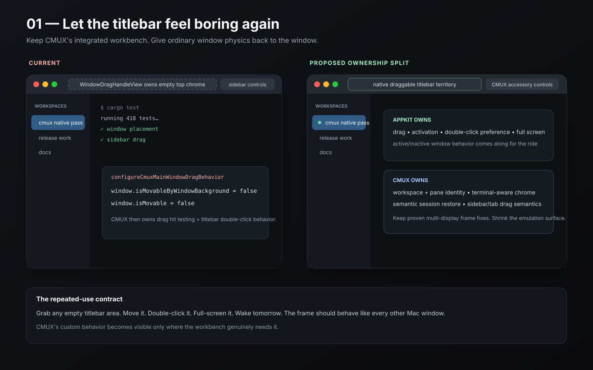
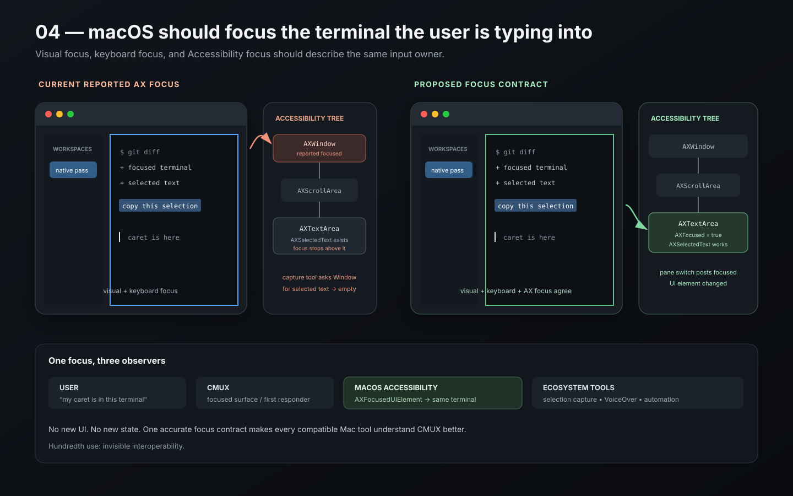

# CMUX after the hundredth use

Four native-Mac seams worth tightening in a product people may inhabit all day.

**Observed:** 2026-09-10  
**CMUX source pinned:** [`132aecbde2c845e80a31be017430bd5090013159`](https://github.com/manaflow-ai/cmux/tree/132aecbde2c845e80a31be017430bd5090013159)  
**Bonsplit source pinned through CMUX:** [`d967a8612e52827cfef8c9343394c98e30dc8801`](https://github.com/manaflow-ai/bonsplit/tree/d967a8612e52827cfef8c9343394c98e30dc8801)

This packet treats macOS convention as stored user expertise. CMUX should spend that expertise where it accelerates the work, and author its own behavior where terminal workflows gain something substantial.

The useful split is:

```text
macOS already solved the gesture + CMUX gains little by changing it
    -> inherit it

CMUX has a real domain advantage
    -> author it

CMUX authored behavior that now has to impersonate the OS
    -> shrink the emulation surface
```

I stayed away from the notification-order / agent-board / global-switcher seams already covered in [`../cmux-spatial-interactions`](../cmux-spatial-interactions/).

## Executive read

| Interaction | Judgment | What I would do |
| --- | --- | --- |
| Window/titlebar physics | **Change the ownership boundary** | Keep CMUX's integrated chrome and semantic session restore; let AppKit own more ordinary titlebar movement, activation, and double-click behavior. |
| File explorer preview | **Change** | Add a true `Space` Quick Look path that preserves tree selection and avoids creating a pane tab until the user chooses to keep the preview. |
| Pane tab selection + focus | **Change** | Give selection a persistent neutral material wash; reserve accent for the pane that owns keyboard focus; keep CMUX's shared backdrop. |
| Accessibility focus | **Fix as a product contract** | Make the focused terminal `AXTextArea` the accessibility-focused element and announce focus changes on pane switches. |
| Native sheets | **Keep** | CMUX already attaches alerts to the relevant main window when possible. |
| Workspace color menu state | **Keep** | The current native submenu marks the active palette entry with `NSMenuItem.state`. Tiny convention, immediate comprehension. |
| Sidebar/workspace drag | **Keep the directness** | Native dragging plus CMUX-specific drop planning is justified; keep improving feedback while preserving pointer position and selection. |

---

# Case 1 — Let the titlebar feel boring again



## Context

CMUX has a real reason to use an integrated window: terminals, workspace navigation, pane tabs, and sidebars benefit from every vertical pixel. The current main window is a real titled, resizable AppKit window with full-size content, native traffic lights, and explicit native-full-screen support.

Then CMUX takes over much of the physical titlebar behavior itself.

Pinned source:

- [`Sources/App/CmuxMainWindow.swift`](https://github.com/manaflow-ai/cmux/blob/132aecbde2c845e80a31be017430bd5090013159/Sources/App/CmuxMainWindow.swift) sets `isMovableByWindowBackground = false` **and** `isMovable = false` for the main window.
- [`Sources/WindowDragHandleView.swift`](https://github.com/manaflow-ai/cmux/blob/132aecbde2c845e80a31be017430bd5090013159/Sources/WindowDragHandleView.swift) supplies explicit drag regions, reads the user's system double-click-titlebar preference, filters interactive controls, and performs the resulting window action.
- `CmuxMainWindow` also owns frame persistence and constraining; AppKit restoration is disabled for the main-window placement path.

The code has earned fixes for real edge cases. Historical examples include [#5099](https://github.com/manaflow-ai/cmux/issues/5099), where titlebar/sidebar hit testing produced dead controls; [#5933](https://github.com/manaflow-ai/cmux/issues/5933), where native full screen and sleep/wake behavior diverged from other Mac apps; and [#6305](https://github.com/manaflow-ai/cmux/pull/6305), which fixed cumulative window drift after sleep/wake. Those specific bugs are fixed. Their family is the evidence.

## 1. Current behavior

```text
real NSWindow
+ fullSizeContentView
+ native traffic lights
+ native full-screen capability

but

window.isMovable = false
-> CMUX drag handle decides where dragging exists
-> CMUX resolves hit testing around controls
-> CMUX reads titlebar double-click preference
-> CMUX applies zoom/minimize behavior
-> CMUX owns frame persistence and extra constrain rules
```

There is a good product intention here: prevent workspace/sidebar drags from accidentally moving the whole window, keep chrome compact, and make minimal mode possible.

## 2. Actual user goal

> Grab the top of the window, move it, double-click it, full-screen it, wake the Mac tomorrow, and find the same work where I left it.

For a daily-use app, this action should become unconscious. The user should never need a CMUX-specific theory of the frame.

## 3. Raw reaction

> This looks like a Mac window until CMUX starts having to impersonate the Mac window.

The closed full-screen report gives the sharper historical version: the reporter could do the same thing in Safari, VS Code, and Finder, while CMUX behaved differently.

## 4. Exact diagnosis

**The break is justified at the visual/product layer. The break extends too far into physical window ownership.**

CMUX gains something from:

- full-size content;
- controls integrated with the workbench;
- minimal mode;
- terminal-aware titles;
- its own semantic restoration of workspaces, panes, agents, and sessions.

CMUX gains very little from re-owning:

- ordinary empty-titlebar drag physics;
- the user's system double-click-titlebar preference;
- activation details around standard chrome;
- basic correspondence between traffic lights, `Ctrl-Cmd-F`, and full screen.

Every custom hit-testing rule also has to coexist with sidebars, resize handles, tab reordering, inactive-window first clicks, multiple displays, Spaces, Full Keyboard Access, and future macOS behavior.

This is exactly where native convention buys decades of learned use.

## 5. Concrete alternative

### Minimal correction

Keep the full-size-content visual treatment. Re-enable native movement for ordinary titlebar territory and reduce `WindowDragHandleView` to the exceptional zones CMUX truly needs.

Interactive controls remain real interactive controls. Workspace rows and pane tabs keep their own drag gestures. Empty titlebar territory belongs to the window.

### Stronger reinterpretation

Split ownership explicitly:

```text
AppKit owns
- traffic lights
- ordinary titlebar drag
- activation
- system titlebar double-click action
- native full screen / Spaces behavior
- active / inactive window presentation

CMUX owns
- workspace + surface identity
- semantic session restore
- terminal-aware title text
- sidebar / pane composition
- workspace and tab drag/drop
- minimal-mode composition
```

Host CMUX-specific titlebar controls through native titlebar/toolbar accessory APIs wherever that gives AppKit reliable hit testing and active/inactive presentation. Keep the custom frame-constrain fixes that solve demonstrated multi-display behavior; the aim is a smaller ownership surface, not a purity exercise.

`app.minimalMode` can remain a CMUX-specific break. In that mode, preserve one predictable native draggable band or native titlebar territory even while most controls migrate into the sidebar.

## 6. Why this should be better

The first use gets more predictable. The hundredth use disappears entirely.

The larger win is engineering/product leverage: every future titlebar control arrives inside a system that already knows about window activation, user double-click preferences, accessibility, display changes, and Spaces. CMUX spends its custom code on terminal/workspace behavior instead.

CMUX also keeps the thing native restoration cannot know: a restored terminal workbench is more than an `NSWindow` frame. CMUX is right to own the semantic session.

## 7. Convention / CMUX behavior this relies on

**Native:** titled `NSWindow`, titlebar accessories/toolbars, system window activation, native full screen, active/inactive appearance, the user's titlebar double-click preference.

**CMUX-specific:** full-size content, minimal mode, terminal-aware title, workspace/pane session restore, custom workspace and pane drag/drop.

### Hundredth-use test

Move the same CMUX window between two displays, tile it, double-click the titlebar, enter/leave full screen, sleep/wake, then repeat across a week. Count every moment where CMUX-specific window behavior becomes perceptible. The target is zero on ordinary frame interaction.

**Judgment:** Change the ownership boundary.

---

# Case 2 — Give CMUX preview a real Quick Look gear


## Context

CMUX's file explorer already has unusually good ingredients for a terminal app:

- a native `NSOutlineView`-based file tree;
- keyboard navigation;
- a Finder-style `Cmd-Down` alias;
- rich in-app previews;
- native file drag/drop;
- configurable double-click activation.

Current source routes both the normal file-open shortcut and the Finder alias through the same action. For local files, the configured `fileExplorer.doubleClickAction` chooses CMUX preview, the default macOS app, or a preferred editor. The historical/default value is `preview`.

Pinned source:

- [`Sources/FileExplorerKeyboardShortcuts.swift`](https://github.com/manaflow-ai/cmux/blob/132aecbde2c845e80a31be017430bd5090013159/Sources/FileExplorerKeyboardShortcuts.swift)
- [`Sources/FileExplorerDoubleClickActionSettings.swift`](https://github.com/manaflow-ai/cmux/blob/132aecbde2c845e80a31be017430bd5090013159/Sources/FileExplorerDoubleClickActionSettings.swift)
- [`Sources/RightSidebarToolPanel.swift`](https://github.com/manaflow-ai/cmux/blob/132aecbde2c845e80a31be017430bd5090013159/Sources/RightSidebarToolPanel.swift)

The important implementation detail: choosing CMUX preview from the right-sidebar file explorer opens a **file surface in the currently focused pane** with `focus: true`, `reuseExisting: true`, and `duplicateWhenFocused: true`. It is a real pane/tab destination.

## 1. Current behavior

```text
select file in Files sidebar
-> Return / configured open shortcut / Cmd-Down / double-click
-> resolve fileExplorer.doubleClickAction
-> default: open CMUX file-preview surface in focused pane
-> focus moves into that surface
```

This is excellent when the user wants to keep the file around beside the terminal.

## 2. Actual user goal

There are two jobs hiding under “preview”:

1. **Inspect:** “What did the agent generate? Is this the right image/PDF/markdown file?”
2. **Keep:** “I want this artifact living beside the terminal while I work.”

The first job can happen twenty times during one coding session. The second job deserves a persistent pane tab.

## 3. Raw reaction

> This says Finder, but my thumb reaches for Space.

And after several files:

> I wanted a glance; I got another destination.

## 4. Exact diagnosis

**CMUX already built the valuable part — the renderer. The repeated-use cost comes from collapsing inspection and opening into the same persistent-surface action.**

Finder teaches a crisp distinction:

```text
Space = inspect this selection without leaving its place
Open = enter / launch the selected object
```

CMUX currently gives `Cmd-Down` a Finder-style alias while keeping preview behind the general open action. That asks Mac users to carry over half the Finder vocabulary and relearn the other half.

The persistent preview also changes focus and participates in pane-tab history. That is useful state for a file the user wants to keep; it is excess state for a five-second inspection.

## 5. Concrete alternative

### Minimal correction

Bind `Space` in the focused file explorer to CMUX preview. Preserve every existing activation preference and shortcut.

This alone buys muscle memory, although it still creates a persistent surface.

### Stronger reinterpretation: CMUX Quick Look

```text
select file
-> Space
-> transient preview appears over / beside the current pane
-> file row stays selected
-> sidebar scroll position stays put
-> j / k or arrows change the selected file and update the preview in place
-> Space or Esc dismisses

while preview is visible:
Return = keep this preview as a pane tab
Cmd-Down = normal configured open action
Drag = existing CMUX file drag behavior
```

The preview should avoid taking keyboard focus from the file list. The user can walk ten screenshots with `j`, `j`, `j`, `k` while one preview surface updates in place.

That is where CMUX can invent a stronger convention of its own: **Finder Quick Look plus terminal-speed list navigation plus one-keystroke promotion into a durable pane tab.**

The transition from transient preview to persistent tab can reuse the same renderer and content state. A brief geometry-preserving move toward the destination pane is enough to explain “this inspection now lives here.” It should remain interruptible and collapse to immediate placement under Reduce Motion.

## 6. Why this should be better

- `Space` arrives with years of Mac muscle memory.
- Inspection stops polluting pane-tab history.
- The file row remains the anchor, so the user can continue walking the tree.
- CMUX's strongest product advantage survives: any useful artifact can still become a first-class pane surface.
- Drag/drop remains continuous and local.
- The transient/persistent distinction becomes legible across pointer and keyboard paths.

On the hundredth use, the user does not “open preview.” They tap Space while their eyes remain on the artifact.

## 7. Convention / CMUX behavior this relies on

**Native:** Finder Quick Look (`Space`, selection persistence, `Esc` dismissal), outline-view selection, direct drag/drop.

**CMUX-specific:** `j/k` navigation, rich preview renderers, pane surfaces, configurable editor activation, current file drag/drop routing.

### Hundredth-use test

Put 30 mixed files in a repo: screenshots, PDF, markdown, source, video. Find five specified artifacts using keyboard only. Compare:

1. current Return/preview-tab flow;
2. Space opening the current persistent preview;
3. transient Space preview with `j/k` live update and Return-to-keep.

Track accidental tab accumulation, focus recovery, and time spent reacquiring the file row.

**Judgment:** Change. This one has an unusually high fluency payoff.

---

# Case 3 — Selection should survive when focus leaves the pane


## Context

CMUX's shared terminal backdrop is a good break from generic native chrome. It keeps split panes feeling like one workbench instead of several little boxed documents.

The current Bonsplit code has a side effect that works against repeated scanning. At CMUX's pinned Bonsplit revision, `activeTabBackground(for:)` returns `.clear` whenever `appearance.usesSharedBackdrop` is true. The hover path, by contrast, gets a visible translucent overlay over the shared backdrop.

Pinned source:

- [`TabBarColors.swift` at Bonsplit `d967a86`](https://github.com/manaflow-ai/bonsplit/blob/d967a8612e52827cfef8c9343394c98e30dc8801/Sources/Bonsplit/Internal/Styling/TabBarColors.swift)
- Open CMUX report [#10023](https://github.com/manaflow-ai/cmux/issues/10023)

The issue reports a selected tab whose main cues are a 1.5 pt top accent line and somewhat brighter label. In an unfocused split, the accent loses saturation, which can leave selection extremely quiet.

## 1. Current behavior

```text
selected tab on shared backdrop
-> transparent selected background
-> brighter label
-> thin accent line

hovered tab
-> visible translucent background

pane loses focus
-> focus accent quiets further
```

The visual hierarchy can therefore say “hover” more loudly than “this tab is the selected object.”

## 2. Actual user goal

> In one glance, tell me which tab each pane contains, then tell me which pane will receive my next keystroke.

Those are two separate questions:

- **selection:** which surface is showing in this pane?
- **focus:** which pane owns keyboard input right now?

A split-pane terminal needs both at once.

## 3. Raw reaction

The current open report starts with the useful sentence:

> “I have trouble finding which tab is selected.”

My reaction after reading the rendering path:

> Hover has more body than selection. The interface rewards my pointer for arriving after the state I was trying to find.

## 4. Exact diagnosis

**Selection and focus are competing for one thin accent cue.**

macOS repeatedly keeps selection visible when focus moves elsewhere: a selected Finder row changes emphasis in an inactive window, but it stays selected. That persistence is useful because selection is object state; focus is input routing.

CMUX needs the same distinction inside one window:

- selected tab = persistent pane state;
- focused pane = current keyboard destination;
- hover = temporary pointer interest.

The shared backdrop is worth keeping. The missing piece is a shared-backdrop-safe selected treatment.

## 5. Concrete alternative

Use three independent channels:

```text
SELECTED
neutral material wash that survives focused/unfocused state
+ primary label weight/color

FOCUSED PANE
system accent line / small pane-edge emphasis

HOVER
lighter temporary wash on a nonselected tab
```

For the shared backdrop, Bonsplit already computes theme-relative hover overlays. Give selection the same compositing strategy at stronger opacity, tuned for light/dark chrome. Preserve enough neutral contrast when the pane becomes inactive; quiet the accent, not the selected object.

The focused pane can keep the existing accent language. A subtle pane-edge cue can help when many tabs share similar titles, especially with Full Keyboard Access or keyboard-only pane movement.

Avoid animation on ordinary tab switching. A selection fill appearing in the next frame is enough. Cross-pane focus can use a very short acknowledgement only when the destination would otherwise be ambiguous.

## 6. Why this should be better

- The user's eye can identify the selected tab before reading labels.
- Keyboard focus becomes a separate, trustworthy signal.
- Hover stops overpowering durable state.
- Shared CMUX material stays intact.
- Inactive panes remain readable without competing with the active pane.
- Accessibility semantics become easier to mirror because the visual model has clean `selected` and `focused` concepts.

At use 100, the user stops scanning the whole tab strip and starts recognizing one stable patch of tone in peripheral vision.

## 7. Convention / CMUX behavior this relies on

**Native:** persistent selection under inactive focus, system accent as a focus/emphasis token, active/inactive presentation.

**CMUX-specific:** shared terminal backdrop, Bonsplit pane model, terminal-theme-derived chrome.

### Hundredth-use test

Create two split panes with 6–8 tabs each, similar titles, and a dark terminal theme. Alternate keyboard focus between panes and switch tabs for five minutes. Run the same pass with pointer hover crossing the tab bars. Count wrong-pane keystrokes and moments spent reading titles to rediscover selection.

**Judgment:** Change the selected treatment; keep the shared backdrop.

---

# Case 4 — The accessibility focus should be the terminal the user is typing into



## Context

CMUX already exposes terminal content in the accessibility tree as an `AXTextArea` with text/selection attributes. An open issue, [#9563](https://github.com/manaflow-ai/cmux/issues/9563), reports that `AXFocusedUIElement` resolves to the `AXWindow` instead of that terminal text area.

The reported tree is roughly:

```text
AXWindow   <- reported focused element
  AXGroup / sidebar
  AXScrollArea
    AXTextArea   <- terminal text and selected-text attributes live here
```

The visible keyboard focus and accessibility focus therefore describe different objects.

## 1. Current behavior

```text
user sees caret in terminal pane
user types into terminal pane
terminal exists as AXTextArea

external accessibility client asks:
"what is focused?"
-> AXWindow

client asks AXWindow for AXSelectedText
-> unsupported
```

The issue specifically calls out selection-capture utilities that work in Terminal, iTerm2, Ghostty, kitty, and WezTerm, then come up empty in CMUX.

## 2. Actual user goal

> Any Mac feature or tool that asks “what is the user typing into?” should receive the same answer the user would give by pointing at the screen.

This covers VoiceOver, Full Keyboard Access-adjacent tooling, selection capture, automation, inspection utilities, and future system features built on Accessibility APIs.

## 3. Raw reaction

> The caret knows where I am. macOS should know too.

## 4. Exact diagnosis

**CMUX's internal focus model reaches the correct terminal, while the accessibility focus contract stops one level too high.**

This is a high-leverage native convention because outside tools depend on a shared protocol. Every compatible Mac app increases the user's expectation that “focused text” can be discovered in the same way.

CMUX gains zero product character from reporting the window as focused while the terminal accepts input.

## 5. Concrete alternative

When a terminal surface becomes the keyboard target:

1. expose that terminal accessibility element as focused (`AXFocused = true` where appropriate);
2. make the app's focused-UI-element query resolve to the terminal `AXTextArea`;
3. post `NSAccessibility.focusedUIElementChangedNotification` when pane/tab focus moves;
4. clear/update the previous surface's focus state;
5. apply the same principle to file explorer, browser, and other first-responder surfaces: accessibility focus follows the real input owner.

Add useful context to the terminal element without reading decorative chrome aloud: workspace title, pane/tab title, and a compact role description are enough.

Validation should include:

- VoiceOver traversal and pane switches;
- a tiny generic AX client reading `AXFocusedUIElement` and `AXSelectedText`;
- keyboard-only pane/tab switching;
- selected text in an inactive pane versus the focused pane;
- multiple CMUX windows.

No animation or visual ornament belongs in this fix. The delight comes from every Mac tool suddenly understanding CMUX.

## 6. Why this should be better

Native accessibility APIs are also interoperability APIs. Correct focus semantics make CMUX cooperate with tools its team will never explicitly integrate.

That is years of learned Mac behavior bought with one accurate answer to “what is focused?”

## 7. Convention / CMUX behavior this relies on

**Native:** `NSAccessibility` focused-element semantics, `AXTextArea`, focus-change notifications, first-responder correspondence.

**CMUX-specific:** its existing focused pane/surface model and terminal accessibility text implementation.

### Hundredth-use test

Switch among terminal panes, browser panes, Files, and a second CMUX window entirely from the keyboard. After every switch, ask an external AX client for the focused element. The answer should follow the exact input target every time.

**Judgment:** Fix. Treat it as product compatibility, not compliance work.

---

# Native behaviors CMUX should keep leaning into

The audit found several places where CMUX is already using the Mac well.

## Sheets: locality is already there

[`CmuxModalAlertPresentation.swift`](https://github.com/manaflow-ai/cmux/blob/132aecbde2c845e80a31be017430bd5090013159/Sources/CmuxModalAlertPresentation.swift) prefers the relevant visible CMUX main window and presents `NSAlert` as an attached sheet when possible, with an app-modal fallback only when a usable host is unavailable or already owns a sheet.

That is exactly the useful part of sheet convention: the decision visibly belongs to one window.

**Keep:** attached locality for rename/custom-color/consequential window-scoped decisions.

**Push further:** repeated utilities belong in a panel, inspector, popover, sidebar, or inline region. The proposed Quick Look preview follows that rule: temporary inspection should remain lightweight and reversible.

## Menus: a tiny fixed detail shows the right instinct

The sidebar's workspace color menu used to omit the selected-state checkmark ([#9709](https://github.com/manaflow-ai/cmux/issues/9709)). Current source now sets `NSMenuItem.state = .on` for the matching palette entry in [`SidebarWorkspaceRowColorMenu.swift`](https://github.com/manaflow-ai/cmux/blob/132aecbde2c845e80a31be017430bd5090013159/Sources/Sidebar/AppKitList/Cells/SidebarWorkspaceRowColorMenu.swift).

That small fix is a perfect example of convention buying learned behavior. The user sees a checkmark and immediately reads the submenu as current single-choice state.

The wider [`SidebarWorkspaceRowCommands.swift`](https://github.com/manaflow-ai/cmux/blob/132aecbde2c845e80a31be017430bd5090013159/Sources/Sidebar/AppKitList/Cells/SidebarWorkspaceRowCommands.swift) also uses real `NSMenu` items and carries configured shortcuts into menu equivalents. Keep one command vocabulary across menu bar, context menu, keyboard, and command palette.

## Sidebar selection: keep CMUX semantics, protect native invariants

The current AppKit workspace list deliberately turns off `NSTableView`'s normal selection painting and selection ownership, then runs its own Command/Shift selection, optimistic click preview, click coalescing, group-anchor policy, and drag planning in [`SidebarWorkspaceTableController.swift`](https://github.com/manaflow-ai/cmux/blob/132aecbde2c845e80a31be017430bd5090013159/Sources/Sidebar/AppKitList/SidebarWorkspaceTableController.swift).

There is a genuine domain reason: workspace groups, hidden anchors, multi-window movement, terminal focus, and multi-workspace commands go beyond a plain Finder list.

The historical bugs [#9221](https://github.com/manaflow-ai/cmux/issues/9221) and [#9690](https://github.com/manaflow-ai/cmux/issues/9690) show the price of fully custom selection dispatch: a row could paint as clicked while the actual workspace selection arrived later or disappeared. Current code contains explicit deferred-click recovery for this class of failure.

I would avoid a wholesale rewrite. I would write down native invariants and make them regression tests:

```text
visible selectable row + completed click -> selection changes exactly once
Cmd-click toggles one visible object
Shift-click extends from a stable visible anchor
inactive window keeps selection legible
selection survives a successful drag/drop
pointer release position survives local reorder
context menu targets the object under the pointer without silently destroying the prior selection set
```

CMUX can own the selection model while still promising Finder-grade predictability.

## Drag/drop: direct manipulation is worth the custom planning

The sidebar uses AppKit drag sessions and pasteboard writers, while CMUX computes its own drop destinations and group-aware reorder plan. The implementation even suppresses auto-scroll after a local drop because the pointer's release location is the user's immediate context.

That is a good break: the product gets domain-aware movement while keeping native physical dragging.

The file explorer is also a natural bridge among files, terminals, preview surfaces, and Finder. Keep pushing toward one object that can be selected, Quick Looked, dragged, opened, copied, or revealed without becoming a different concept each time.

## Restoration: CMUX should keep the semantic layer

A terminal workbench has running processes, panes, agent sessions, browser/file surfaces, working directories, and workspace identity. CMUX has good reasons to own that semantic restoration rather than delegate the whole problem to `NSWindowRestoration`.

The useful boundary is:

```text
CMUX remembers what the work is.
macOS handles ordinary window behavior around that work wherever practical.
```

That keeps relaunch magical without turning every titlebar gesture into application-specific physics.

## Overview / focus transitions

The existing [`cmux-spatial-interactions`](../cmux-spatial-interactions/) case already argues for stable workspace geography and parent identity in global switching. I would carry one additional rule into any overview work:

> Zoom out from the real pane/window geometry, then zoom back into the same object.

Motion should explain travel. The selected object should stay recognizable through the transition. Repeated focus switches can complete immediately; overview entry/exit earns a short spatial transition because it explains correspondence.

## Motion + materials

CMUX's shared terminal backdrop is worth defending. The pane-tab proposal uses another translucent layer on that backdrop instead of replacing it with opaque tab chrome.

CMUX also has focus-flash animation for right-sidebar tool panes. Keep effects like this local, brief, interruptible, and subject to Reduce Motion. The hundredth invocation should read as acknowledgement, never ceremony.

---

# One charming detail with almost no operating cost

**Reuse the workspace color as a 5–6 pt identity dot beside the active workspace title anywhere CMUX already shows a window/workspace title.**

No animation. No new state. No new command. No mascot.

```text
● payments-api — tests
● launch-site — deploy
● cmux — native focus pass
```

The dot comes from the existing workspace color. When the workspace has no custom color, omit it. In multi-window use it becomes a tiny landmark; in a Window menu or title-bearing chrome it gives CMUX a quiet signature.

It earns its keep because the same color already identifies the workspace in the sidebar. The detail extends an existing object identity instead of adding decoration.

---

# What I would put in front of the CMUX team

Start with the four SVGs and ask four questions:

1. **Window:** which pieces of custom titlebar ownership still buy a concrete CMUX advantage today?
2. **Files:** should “inspect” and “keep as pane surface” become separate verbs, with `Space` owning inspect?
3. **Tabs:** can selection remain visible through inactive-pane focus while accent continues to mean keyboard destination?
4. **Accessibility:** can every internal focus transition produce the exact same focused object through macOS Accessibility APIs?

Then keep the rest of the audit as a constraint: preserve CMUX's shared backdrop, multi-pane workbench, direct drag/drop, semantic session restoration, real native menus, and attached sheets.

The goal is a CMUX that feels more like itself after becoming more fluent in the Mac — compact, direct, spatial, and a little lovely after the hundredth command.

— Pip 🐇
