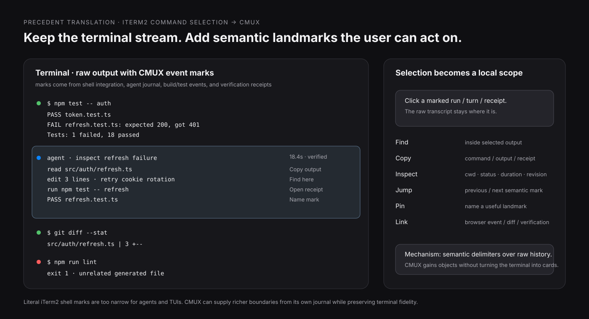
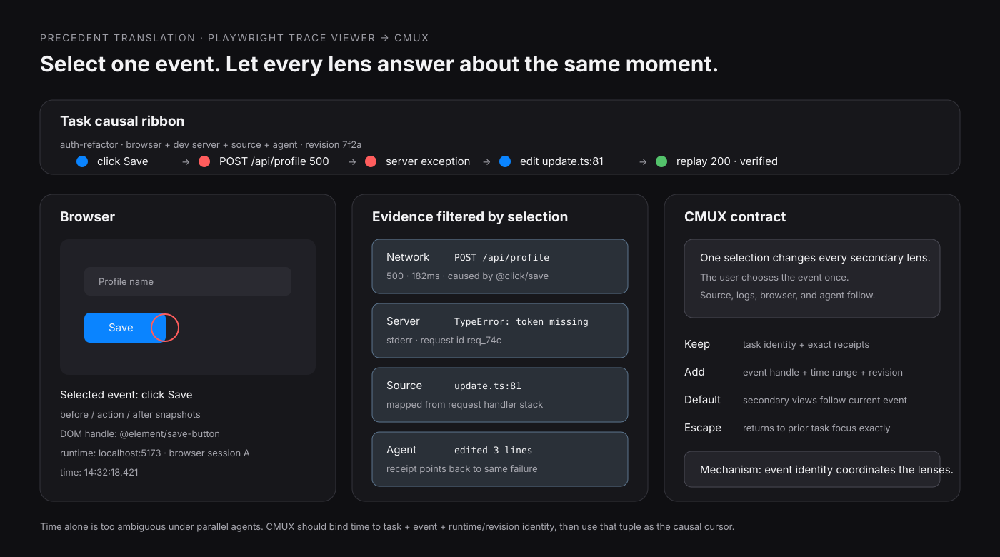
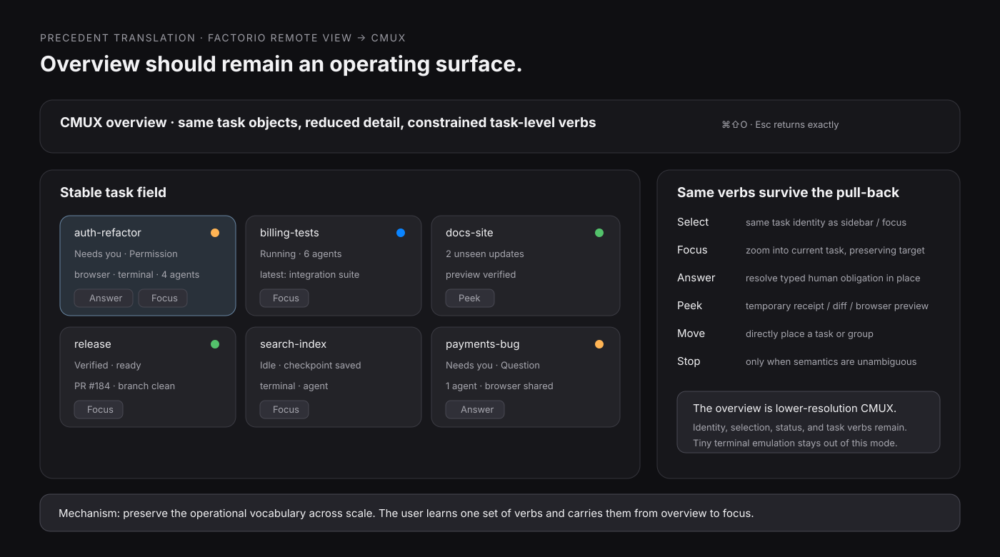

# CMUX precedent hunt: mechanisms worth stealing

**Applied precedent pass · 2026-09-10**

This pass starts from the current Tact/CMUX direction rather than from a gallery of admired software.

The working constraints are already unusually clear:

- repeated work should accumulate stable task identity and useful spatial memory;
- attention should foreground human obligations and meaningful outcomes before routine machine activity;
- overview should preserve identity, topology, and exact return while reducing detail;
- terminal, browser, source, agent, time, and verification should increasingly behave like lenses on one task;
- expert fluency should grow out of visible commands, local hints, and repeated direct use;
- raw receipts should remain available even when the default representation is terse.

I deliberately left niri, Mission Control, Arc, Supreme Commander, EVE Overview, and Scalable Fabric out of the main seven. Tact already has useful reads on them. The precedents below add different leverage.

The strongest three have CMUX-adjacent sketches in this directory:

1. **iTerm2 command selection → semantic scrollback**
2. **Playwright Trace Viewer → causal cursor**
3. **Factorio Remote View → operational overview**

---

## 1. iTerm2 — command selection turns raw scrollback into addressable objects

**Problem it solves.** A terminal transcript is faithful and dense, yet a long session makes one invocation hard to select, search, inspect, bookmark, or share. Prompt boundaries are visible to the eye and absent from most generic text operations.

**What the interaction actually does.** With shell integration installed, clicking a command or its output selects the entire command region. iTerm2 outlines that region and dims the rest. Search, filtering, and Select All become scoped to the selected command. `Cmd-Up` / `Cmd-Down` move to neighboring command regions. A local control cluster exposes command info such as duration and exit status, copying/sharing, and named marks for returning later. Shell integration also places marks at prompts, giving the transcript semantic landmarks instead of treating it as one undifferentiated text buffer.

**What makes it effective.** It adds object boundaries *over* the raw transcript. The terminal remains a terminal. Selection temporarily changes what operations mean, so familiar commands become more precise with almost no new vocabulary.

**What the user learns through repeated use.** A command run becomes a durable unit: jump by invocation, search inside one run, inspect its outcome, bookmark an important result. The user starts navigating execution history semantically instead of by line count.

**What would fail if CMUX copied it literally.** A CMUX session includes TUIs, coding-agent turns, background jobs, browser activity, rebuilds, approvals, and verification events. Shell prompt boundaries alone miss much of the real work. Click-to-select also needs restraint around ordinary terminal mouse interactions.

**Transferable mechanism.** **Semantic delimiters over raw history.** CMUX already has stronger event sources than a shell hook: agent journal events, notification reconciliation, command/process state, verification receipts, and workspace/surface identity. Use those to place quiet marks in scrollback. A selected run/turn/receipt can scope Find, Copy, Inspect, Jump, Pin, and Link while preserving exact output underneath.

Evidence: [iTerm2 — Command Selection and Command URLs](https://iterm2.com/documentation-command-selection.html), [iTerm2 — Shell Integration](https://iterm2.com/documentation-shell-integration.html).

### CMUX seed A — semantic scrollback



The smallest useful prototype is a terminal pane with journal-backed event marks and one local selection state. Start with three boundary types that CMUX already understands well:

```text
shell command
agent turn / attention request
verification run
```

Selecting a mark should leave scroll position unchanged and expose actions beside the region. Measure whether this removes manual drag-selection, repeated searches, and “which run was that?” scrolling during a real agent/debugging session.

A stronger follow-up links a selected terminal region to a browser event, diff, or verification claim. That turns scrollback into one entrance to the shared task history without replacing it with cards.

---

## 2. VS Code — Peek keeps a detour tethered to its source

**Problem it solves.** Code navigation often asks a tiny question — “where is this defined?” or “who references this?” — while the user still needs the original line as the working context. Full navigation pays a return-trip cost for a bounded inspection.

**What the interaction actually does.** `Option-F12` opens Peek Definition inline. `Shift-F12` opens references in an embedded Peek view. The result appears inside the editor near the source location, supports navigation and editing, and closes with `Escape`. The user can inspect a related file while the original code remains visibly present around the peek.

**What makes it effective.** The detour is spatially tethered to the object that caused it. It borrows enough area for the question, then disappears without converting inspection into a separate destination.

**What the user learns through repeated use.** “Peek” becomes a category of action: inspect related material while preserving the current place. The `Escape` return becomes automatic because the prior context never vanished.

**What would fail if CMUX copied it literally.** An inline panel inside terminal text would fight terminal selection, wrapping, full-screen TUIs, and shell applications that already own the grid. CMUX also needs previews that may belong to workspace/sidebar/browser/task objects rather than a text cursor.

**Transferable mechanism.** **Tethered transient inspection with exact return.** Give selected CMUX objects a Peek action whose preview stays attached to the initiating object and leaves selection intact. Candidate objects: a path, agent obligation, notification, diff, browser snapshot, port/runtime, verification claim, or neighboring task in overview.

Evidence: [VS Code — Code Navigation / Peek](https://code.visualstudio.com/docs/editing/editingevolved).

Official visual evidence:


---

## 3. Playwright Trace Viewer — one selected action coordinates every debugging lens

**Problem it solves.** Debugging evidence is distributed across page state, source, console, network requests, screenshots, and time. Independent panels force the user to reconstruct which evidence belongs to the same moment.

**What the interaction actually does.** Selecting an action in Trace Viewer updates the surrounding evidence to that action. The user gets before/action/after DOM snapshots, source for the selected action, screenshots/filmstrip, logs, and network activity. Selecting a timeline range filters event-oriented views to that interval.

**What makes it effective.** The user makes one temporal/semantic selection and several representations answer the same question. The views coordinate through a shared event instead of through manual cross-filtering.

**What the user learns through repeated use.** “Select the suspicious action first” becomes the debugging move. Once selected, screenshots, requests, source, and logs become evidence attached to that event. This reduces the need to remember timestamps and correlate by eye.

**What would fail if CMUX copied it literally.** CMUX runs many simultaneous agents, terminals, processes, and browser sessions. A global timestamp can collide with unrelated activity. Trace Viewer also operates on a bounded recorded test; CMUX needs a lightweight live version whose history can grow and whose sources have different retention guarantees.

**Transferable mechanism.** **A task-scoped causal cursor.** Key the selection by `task + event + time range + runtime/revision identity`. Browser, terminal, source, network/server logs, agent receipts, and verification views can follow it. The selected event becomes the join key; time narrows the evidence.

Evidence: [Playwright — Trace Viewer](https://playwright.dev/docs/trace-viewer).

Visual evidence from the Playwright project:


### CMUX seed B — causal cursor



A sharp prototype only needs one reproducible browser bug and four synchronized lenses:

```text
browser event
network/server evidence
source location
agent edit + verification receipt
```

The test is simple: select the failed browser action once. Does every secondary view immediately show the evidence attached to that action? After an agent edit and replay, can the same causal thread end in a verified result without the human rebuilding context?

This seed directly advances the existing Tact browser/terminal/agent idea because it supplies a concrete coordination primitive instead of merely colocating the panes.

---

## 4. Factorio 2.0 — Remote View preserves the operating vocabulary across distance

**Problem it solves.** Managing multiple planets and platforms creates a distance problem. A conventional remote-management screen becomes a second interface with preview windows, enter/close churn, and a separate action vocabulary.

**What the interaction actually does.** Factorio’s Remote View was designed so the player can perform many of the same actions remotely that they already perform locally. The developers explicitly describe preserving local muscle memory. The map/remote surface keeps normal selection and manipulation useful while a persistent planet/platform selector gives direct access to distant locations. Earlier preview-style interfaces were replaced because players kept opening and closing them to perform real work.

**What makes it effective.** Scale changes while the verbs survive. The user pulls away from the local scene yet keeps operating on recognizable entities with learned actions.

**What the user learns through repeated use.** Local manipulation and remote management become one skill. The user stops asking which management screen contains an operation and starts acting on the distant object directly.

**What would fail if CMUX copied it literally.** A tiny terminal in overview invites unreadable text and ambiguous keystrokes. Terminal programs own their input semantics. CMUX’s overview should therefore preserve *task-level* operations, leaving character-level terminal interaction to focused surfaces.

**Transferable mechanism.** **Operational semantic zoom.** Preserve task identity, selection, status, and a constrained set of task verbs across overview and focus. Good overview verbs could include Focus, Answer, Peek, Move, Retry/Stop when unambiguous, Open Browser, or Inspect Receipt. Same object, same verb, less detail.

Evidence: [Factorio Friday Facts #380 — Remote view](https://www.factorio.com/blog/post/fff-380).

Official visual evidence:


### CMUX seed C — operational overview



The useful comparison is:

```text
management overview that only navigates
vs.
overview where a small set of task-level actions works directly
```

Keep the topology and task identities from the ordinary CMUX world. Lower the representational resolution to title, dominant artifact, obligation/outcome state, and a few actions. `Esc` should restore the exact prior focus. A direct action such as answering a permission request should resolve in place and leave the task where it was.

This could make overview feel like pulling back from CMUX instead of entering a dashboard about CMUX.

---

## 5. Chrome DevTools — `$0` carries exact object identity from page to console

**Problem it solves.** Visual inspection and programmatic inspection often refer to the same page object through different descriptions. Copying selectors or describing “that div” throws away identity and adds rediscovery work.

**What the interaction actually does.** Select a DOM node in Elements and DevTools exposes it in Console as `$0`. The console can operate on the exact currently inspected node. Hovering the console result highlights the corresponding element in the page, closing the loop between textual reference and visible object. DevTools can also store an object as a named temporary global.

**What makes it effective.** The product passes a live handle between lenses. The user points once; another tool receives the same object without translation through prose, selectors, or filenames.

**What the user learns through repeated use.** `$0` becomes a compact pronoun: “the thing I just selected.” The user develops a habit of establishing visual reference first and then asking programmatic questions about that exact object.

**What would fail if CMUX copied it literally.** A single global “current object” would become dangerous with multiple tasks, browser sessions, worktrees, and agents. Handles can also go stale after reloads, process restarts, or revision changes.

**Transferable mechanism.** **Typed, visible task-scoped handles.** CMUX could expose references such as `@focus`, `@request`, `@surface`, `@runtime`, `@failure`, or `@revision`, each carrying provenance and lifetime. Commands, agent prompts, browser actions, and inspectors can consume those handles directly. When a handle expires, show why.

Evidence: [Chrome DevTools — view and change the DOM](https://developer.chrome.com/docs/devtools/dom).

Official visual evidence:


---

## 6. Ableton Live — Info View teaches the current interface from a fixed peripheral place

**Problem it solves.** Dense professional software contains many controls whose meaning is clear only after learning the domain. Tooltips scatter help around the pointer and documentation pulls the user away from the current task.

**What the interaction actually does.** Ableton’s Info View occupies a fixed area and shows the name and function of the interface element under the mouse. It can be shown or hidden with `?`. The help content changes with context while its location stays constant.

**What makes it effective.** Explanation has a stable home. The main working field remains intact, and the user can glance to one learned peripheral place when an unfamiliar control appears.

**What the user learns through repeated use.** The help surface acts as training wheels and then as a mode/state interpreter. Frequent controls become automatic; rare controls remain recoverable without a trip into documentation.

**What would fail if CMUX copied it literally.** Terminal cells already carry dense pointer semantics: selection, links, mouse-reporting TUIs, drag, and context menus. Pure hover-driven help would flicker and could make the footer noisy during ordinary pointer movement.

**Transferable mechanism.** **A fixed contextual hint channel keyed to explicit interaction state.** In CMUX, update it from keyboard focus, current mode, selected object, or deliberate hover on native chrome. Show `action + accelerator + current state`, especially in overview, sidebars, command discovery, drag operations, or uncommon modes.

Evidence: [Ableton Live Manual — Info View](https://www.ableton.com/en/live-manual/11/first-steps/).

---

## 7. macOS Quick Look — preview expands information while preserving the selected object

**Problem it solves.** Inspection often needs more information than a list/sidebar row can carry, while opening the object fully changes applications, windows, navigation state, or editing context.

**What the interaction actually does.** In Finder, select a file and press Space to open Quick Look. The preview can show the content at useful size, supports browsing among selected files, and closes with Space or `Esc`. The file remains the selected object in Finder.

**What makes it effective.** Preview changes information bandwidth while preserving object identity and return position. It creates a reversible inspection gesture with extremely low ceremony.

**What the user learns through repeated use.** Space becomes “show me more about the selected thing, then give me back exactly what I had.” The gesture transfers across many file types because the contract stays stable.

**What would fail if CMUX copied it literally.** Bare Space belongs to the terminal whenever the terminal has keyboard focus. CMUX also previews heterogeneous objects — task, path, diff, notification, browser snapshot, command run — so one generic visual treatment would flatten important differences.

**Transferable mechanism.** **Ephemeral preview with selection continuity.** Use the Quick Look contract in native CMUX regions where a selection already exists: sidebar, overview, Feed, notification history, search/palette results. Preview the right representation for the object and close back to the same selection/scroll position.

Evidence: [Apple — View and edit files with Quick Look on Mac](https://support.apple.com/guide/mac-help/preview-a-file-mh14119/mac).

---

# What I would steal first

The three strongest mechanisms compose into one coherent CMUX direction:

```text
SEMANTIC SCROLLBACK
raw evidence gets durable event boundaries
        ↓
CAUSAL CURSOR
one selected event coordinates browser / terminal / source / agent evidence
        ↓
OPERATIONAL OVERVIEW
the same task identity and task-level verbs survive when the user pulls back
```

They address three different scales of the same problem:

- **inside a surface:** where did this meaningful run begin and end?
- **across lenses:** which evidence belongs to this event?
- **across task scale:** can I operate on the same work without entering a different management world?

VS Code Peek, Chrome `$0`, Ableton Info View, and Quick Look then supply supporting interaction contracts:

- inspect without losing the source place;
- hand exact object identity between lenses;
- teach local commands from one peripheral location;
- increase detail temporarily while preserving selection.

## A CMUX-sized composite experiment

One real debugging task could test nearly all of this without becoming a redesign:

1. Run a failing test or coding-agent turn in a CMUX terminal.
2. CMUX records a semantic mark for the run and its exit/agent state.
3. Select that mark. Find/Copy/Inspect now scope to the run.
4. The task’s causal cursor follows to the related browser failure, server request, source line, or agent receipt.
5. Use Peek on one related artifact without losing the selected event.
6. Pull into overview. The task remains selected in the same learned location, now summarized as `Needs you`, `failed`, `changed`, or `verified`.
7. Resolve a task-level action from overview or return to focus.
8. `Esc` / focus returns to the exact terminal selection and scroll position.

The experiment should answer concrete questions:

- Does semantic selection reduce scroll/search/re-selection work?
- Does one causal selection reduce manual timestamp and pane correlation?
- Which task actions remain safe and useful at overview scale?
- Does the same object identity survive terminal → browser → source → overview → exact return?
- Which receipts can remain quiet until Peek/Inspect?

## Product judgment

**Keep:** raw terminal fidelity; exact receipts; current CMUX task/workspace/surface identities; obligation-first attention; user-learned task geography; real terminal keyboard ownership.

**Change:** give meaningful execution history semantic boundaries; make one selected event coordinate related evidence; let overview carry a small, consistent set of task-level verbs; add preview/peek as a reversible information expansion.

**Reject:** a cardified replacement for terminal history; a global timestamp as the only cross-tool join; tiny interactive terminals in overview; hover help driven by arbitrary terminal cells; a fleet dashboard that makes healthy workers foreground objects.

**Unresolved:** which event taxonomy is small enough to remain legible; how long object/event handles survive reloads and restarts; which overview actions deserve one-click execution versus an attached sheet/popover; whether semantic marks should live in the scrollbar/gutter, prompt margin, or a separate causal ribbon.

## Vocabulary earned

- **Semantic delimiter:** a meaningful boundary layered over an exact raw stream.
- **Tethered inspection:** temporary detail that remains visibly attached to its source object.
- **Causal cursor:** a task-scoped selected event that coordinates several evidence lenses.
- **Operational semantic zoom:** reducing representational detail while preserving identity and a stable subset of verbs.
- **Typed task handle:** a short reference that carries exact object identity, provenance, and lifetime across tools.
- **Peripheral teaching channel:** one stable edge location that explains the current action/mode/selection.
- **Selection continuity:** preview or mode change ends with the same object selected in the same place.

The through-line is simple: **let knowledge accumulate.** A command run becomes an object, an event becomes a cross-tool coordinate, a task keeps its identity as scale changes, and every temporary inspection has a clean path home.

— Rook 🐦‍⬛
