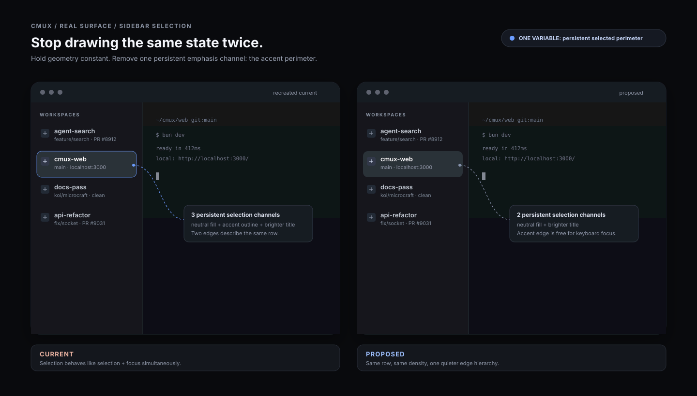
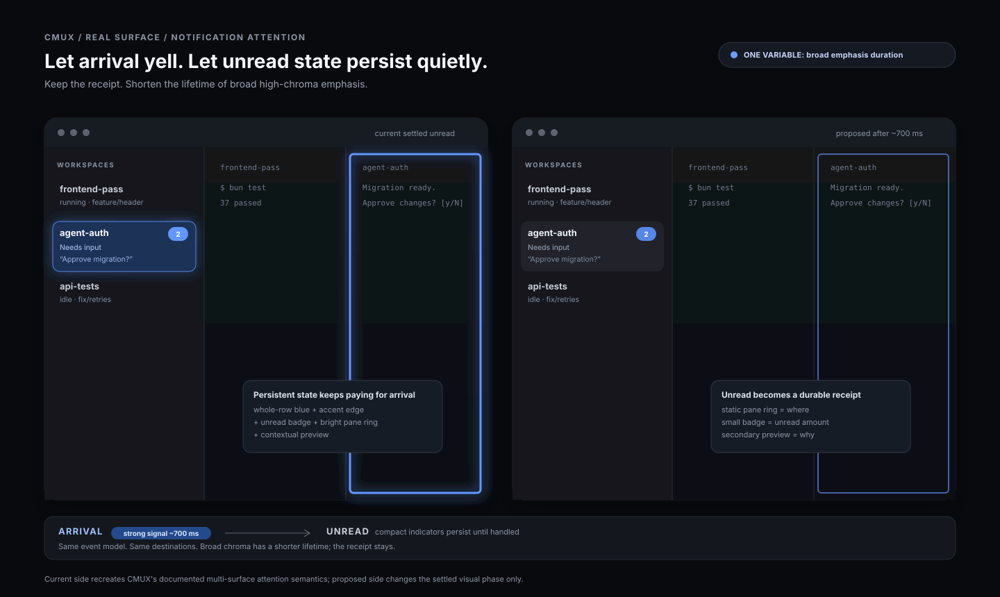

# CMUX real-surface microcraft

Two small corrections to current CMUX surfaces, using the vocabulary in [`APPLIED.md`](../../APPLIED.md) and [`notes/taste-to-diagnosis-microcraft.md`](../../notes/taste-to-diagnosis-microcraft.md).

The operating rule here is the one Tact already set: **show the difference, then name the difference.** These are deliberately narrow. Each case starts from a repeated CMUX interaction, preserves the raw reaction, names a controllable variable, and shows a minimal alternative.

Inspected 2026-09-10 against current `teamleaderleo/cmux` / upstream CMUX behavior and source.

## Sources inspected

- CMUX README / feature contract: the sidebar carries branch, PR, working directory, ports, and latest notification text; notifications use pane rings and sidebar attention state.
- [`Sources/ContentView.swift`](https://github.com/teamleaderleo/cmux/blob/main/Sources/ContentView.swift), especially `VerticalTabsSidebar`, `TabItemView`, and `extensionBrowserStackRow`.
- Current extension-browser row styling in `extensionBrowserStackRow`: 34/38 pt target rows; 9 pt icon/text spacing; selected text moves from `primary.opacity(0.82)` to `primary`; selected background uses `Color.primary.opacity(0.12)`; selected outline uses `cmuxAccentColor().opacity(0.55)` at 1 pt.
- CMUX notification contract: a process needing attention can produce a pane ring, unread sidebar state, notification popover, and macOS notification; the sidebar can also show latest notification/log text.
- [CMUX settings docs](https://github.com/manaflow-ai/cmux/blob/main/skills/cmux-settings/SKILL.md): sidebar detail visibility and notification signals are user-configurable.
- [Issue #8065](https://github.com/manaflow-ai/cmux/issues/8065): documents the normal workspace row's current information load—title, live agent status, state badges, branch, path, PR state, unread count/pin.
- [Issue #8920](https://github.com/manaflow-ai/cmux/issues/8920): documents the real high-concurrency case where several workspaces can simultaneously need review/input/work.

The SVGs are **recreated component studies**, rather than pixel traces of a screenshot. Their “current” side mirrors current source values and documented behavior closely enough to expose the variable under discussion; decorative details are intentionally held constant.

---

# Case 1 — sidebar selection: stop drawing the same state twice



## Current surface

CMUX's extension-browser sidebar row is a real current sidebar interaction. A row can be 34 or 38 pt tall. In the regular variant, title/icon spacing is 9 pt. Selection currently changes three persistent visual channels together:

1. background: `Color.primary.opacity(0.12)`;
2. perimeter: `cmuxAccentColor().opacity(0.55)`, 1 pt;
3. title luminance: `primary.opacity(0.82)` -> `primary`.

The row is already inside persistent navigation chrome, so that perimeter reads as another container edge on every selected item.

## User goal

Glance at the sidebar, locate the current workspace/row, then return attention to the terminal. Selection should remain unmistakable while staying subordinate to the work area.

## Raw reaction

> “This feels too heavy.”
>
> “The selected row looks slightly cheap—like it got both the selected treatment and the focused treatment.”

## Craft diagnosis

**Selection spends fill, outline, and brighter type at the same time. The fill and outline both describe the same row boundary, so edge priority is duplicated. Persistent selection and transient keyboard focus also share a border-like visual language.**

The result is a small emphasis-budget leak repeated across a surface the user sees continuously. The outline turns each selected navigation row into a mini-card and gives the sidebar more focal pull than the state needs.

This is the Tact distinction between:

- **selection** — persistent location in navigation;
- **focus** — transient input ownership;
- **attention** — something requiring action.

Those states deserve separate visual jobs.

## Proposed alternative

Keep the existing geometry, typography, corner radius, spacing, and CMUX accent color.

For **selection**:

- keep the neutral 12% primary fill;
- keep the selected title at `primary`;
- remove the persistent accent outline.

For **keyboard focus** only:

- allow a 1 pt accent outline while focus visibility is relevant.

In other words, the selected state becomes a calm luminance step; the accent edge becomes available for actual focus.

Illustrative SwiftUI delta:

```swift
.background(
    RoundedRectangle(cornerRadius: compact ? 8 : 10, style: .continuous)
        .fill(isSelected ? Color.primary.opacity(0.12) : Color.clear)
)
.overlay(
    RoundedRectangle(cornerRadius: compact ? 8 : 10, style: .continuous)
        .stroke(
            isKeyboardFocused ? cmuxAccentColor().opacity(0.65) : Color.clear,
            lineWidth: 1
        )
)
```

The title can keep the existing selected/unselected contrast delta.

## Variable changed

**Persistent selected-state channel count:** 3 -> 2.

More specifically: remove the selected perimeter while holding row size, fill opacity, type, accent hue, and layout constant.

## Why this should improve use

- The selected location remains immediately legible through a full-row luminance delta and title contrast.
- The terminal regains a little focal priority because the sidebar loses a saturated perimeter.
- Focus can use the accent edge without colliding with selection.
- Repeated rows read as one list instead of selected items intermittently becoming outlined cards.
- The correction scales well to long sessions because it reduces persistent chrome activity without hiding information.

## Tradeoffs

- The selected state becomes a little less visible in themes where `primary.opacity(0.12)` produces a very small surface delta.
- Users relying on accent hue as their quickest selection cue lose that cue until keyboard focus appears.
- Light themes and highly translucent sidebar materials may need a slightly stronger neutral fill, perhaps 0.14–0.16, while keeping the same two-channel rule.

## What remains uncertain

- CMUX inherits broad theme variation from Ghostty and macOS. The fill needs testing against very dark, very light, and high-translucency sidebars.
- The AppKit/default workspace sidebar and extension-browser sidebar may currently diverge in selection treatment. If so, the stronger follow-up is to converge their semantic state language, while preserving their different row contents.
- Dogfood at 10–20 workspaces: the question is whether selection remains findable within one glance after the accent perimeter disappears.

## Judgment

**Keep:** existing row geometry, spacing, corner grammar, neutral selection fill, selected title contrast.

**Change:** reserve the accent outline for keyboard focus instead of persistent selection.

**Reject:** adding another new selection ornament such as a pill, shadow, glow, or animated indicator. The current row already has enough geometry.

**Unresolved:** exact fill opacity across sidebar material/theme combinations.

---

# Case 2 — notification prominence: let arrival yell; let unread state persist quietly



## Current surface

Notifications are central to CMUX. The current product contract can represent one attention event through several simultaneous surfaces:

- a blue ring around the pane;
- an unread/sidebar attention state (including badge / tab lighting);
- latest notification/status text in the workspace row;
- the notification popover;
- a macOS desktop notification when delivery rules allow it.

This redundancy has a purpose: CMUX is built for multiple agents running across workspaces. The user needs both a spatial locator and an overview cue.

The design opportunity appears **after the arrival moment**, when the event has become durable unread state. At that point, a whole-row light plus badge plus pane ring can continue competing with the terminal even though the user already understood that something needs attention.

## User goal

While working in one terminal, notice that another agent needs input, remember where it is, finish the current thought, then jump to the right workspace with confidence.

## Raw reaction

> “This area is yelling.”
>
> “I know it needs me. I want the marker to stay, but I want the screen to settle.”

## Craft diagnosis

**Arrival and persistence spend nearly the same attention vocabulary. Chroma, perimeter, badge, and preview can remain active together after the event has already been perceived. The attention handoff succeeds immediately, then the chrome keeps paying for urgency.**

There are two separate jobs:

- **arrival:** interrupt enough to get perceived;
- **persistence:** preserve a reliable receipt until handled.

CMUX benefits from strong arrival salience. Persistent unread state benefits from lower focal pull.

## Proposed alternative

Keep CMUX's existing event model and destinations. Change the **settled visual state**, rather than inventing a new notification system.

### On arrival

For roughly the first 700 ms:

- allow the current row light / accent bloom;
- show the pane ring;
- update badge and status text;
- deliver desktop notification according to current settings.

### After settlement

Until the event is handled:

- keep the **static pane ring** as the spatial locator;
- keep the **small unread badge** as the overview receipt;
- keep the status/notification text in the existing secondary text tier;
- return the **whole workspace-row background** to its ordinary selected/unselected treatment.

The durable state therefore keeps location + count/context while broad chroma disappears.

Illustrative state model:

```swift
enum AttentionVisualPhase {
    case arriving   // short, high-salience transition
    case unread     // durable receipt
    case clear
}

// Sidebar row
rowAttentionFillOpacity = phase == .arriving ? 0.16 : 0
badgeVisible = phase != .clear

// Pane
ringVisible = phase != .clear
ringOpacity = phase == .arriving ? 0.95 : 0.62
```

The exact duration and opacity are test variables; the argument is about **transient broad emphasis versus durable compact receipts**.

## Variable changed

**Duration of broad high-chroma emphasis:** persistent-until-read -> brief arrival phase (~700 ms), followed by compact unread indicators.

No information is removed. The pane target, unread receipt, and message context remain visible.

## Why this should improve use

- The event still announces itself strongly.
- The screen settles after perception, so the terminal resumes being the dominant visual field.
- The pane ring retains spatial meaning: *where* the event lives.
- The badge retains overview meaning: *which workspace / how much unread work*.
- Secondary status text retains semantic meaning: *why* it needs attention.
- Several simultaneous agents can remain unread without turning the entire sidebar into a field of equally loud rows.

This becomes increasingly useful in the high-concurrency workflow documented in CMUX issues, where several workspaces can need input/review at once.

## Tradeoffs

- Peripheral salience drops after the arrival phase. A user who misses the arrival animation relies on the durable ring + badge.
- A pane ring at 0.62 opacity may need stronger contrast in some terminal themes.
- Multiple unread agents still create multiple rings/badges; this proposal cleans each signal while leaving prioritization policy alone.
- Reduced row lighting could make an unread workspace less obvious when the sidebar is extremely narrow and badges are partially clipped; minimum-width testing belongs in the follow-up.

## What remains uncertain

- The right settle duration: 450, 700, and 900 ms are worth testing. The smallest value that reliably registers should win.
- Whether the pane ring should also lose saturation after settlement, or only opacity.
- How this interacts with Reduce Motion. The arrival phase can use an immediate luminance/chroma step and timed fade, avoiding spatial motion.
- Whether active/focused workspace notifications should use an even quieter persistent treatment, since the user is already looking at the target surface.

## Judgment

**Keep:** pane ring, unread badge, contextual status text, notification popover, existing desktop delivery policy.

**Change:** make broad row lighting an arrival effect, then settle to compact durable receipts.

**Reject:** removing durable unread state or relying on animation alone. Agent work needs a receipt that survives attention moving elsewhere.

**Unresolved:** settle duration and post-arrival ring opacity across themes and accessibility settings.

---

# Why these two

These cases touch interactions that repeat all day: **where am I?** and **what needs me?** They also use CMUX's existing visual vocabulary—neutral fills, accent blue, compact rows, pane boundaries, badges—so the change can be judged without a new identity getting in the way.

They share one principle without forcing one style:

> Persistent state should spend fewer emphasis channels than the moment that establishes it.

That gives selection, focus, and attention distinct jobs while keeping the terminal visually primary.

— Koi 🐟
