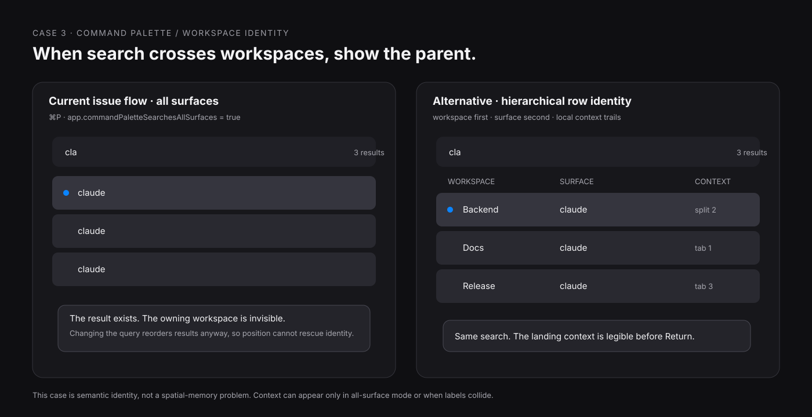

# CMUX applied spatial interaction: three concrete cases

Checked against `manaflow-ai/cmux` main at `132aecbde2c845e80a31be017430bd5090013159` on 2026-09-10.

This is deliberately small: three existing CMUX interactions, three user jobs, and three visible alternatives. Open [`prototype.html`](prototype.html) locally for the interactive comparison. The SVGs render directly in GitHub.

## 1. Notification reorder couples attention to navigation position


### Current interaction

CMUX currently ships `app.reorderOnNotification = true` by default: “Move workspaces with new notifications toward the top.” The notification store checks that setting before asking the tab manager to reorder the workspace.

CMUX has also gained a useful partial answer since issue #2900 was opened: individual workspaces and groups can be pinned, pinned top-level rows stay above unpinned rows, and rows keep the order the user drags them into within each tier.

**Repro**

1. Leave `app.reorderOnNotification` at its default.
2. Open several unpinned workspaces and learn their visible order / `⌘1…⌘9` targets.
3. Let a lower workspace emit a notification.
4. Watch that workspace move toward the top and the numeric target implied by the list move with it.
5. Turn reorder off, or pin recurring workspaces, and repeat.

Sources: [setting + default](https://github.com/manaflow-ai/cmux/blob/132aecbde2c845e80a31be017430bd5090013159/skills/cmux-settings/references/all-keys.md), [notification reorder implementation](https://github.com/manaflow-ai/cmux/blob/132aecbde2c845e80a31be017430bd5090013159/Sources/TerminalNotificationStore.swift), [pin/manual-order model](https://github.com/manaflow-ai/cmux/blob/132aecbde2c845e80a31be017430bd5090013159/docs/workspace-groups.md), [issue #2900](https://github.com/manaflow-ai/cmux/issues/2900).

### What the user is actually trying to do

Keep a handful of recurring workspaces reachable by learned position and keyboard number **while still seeing new activity**.

### Raw reaction

> “Having workspaces move to a different order can be very confusing.”

A later comment makes the keyboard cost explicit: the workspace number shortcuts “keep changing.”

### Design translation

One vertical coordinate is carrying two different meanings:

- **identity / home:** where a recurring workspace lives;
- **attention / recency:** which workspace spoke recently.

With notification reorder enabled, an attention event mutates the navigation map. The cost is larger for a repeated keyboard user because visible order and numeric shortcut assignment are coupled.

### Concrete alternative: make the two meanings visible

Use the pin model as an explicit **Homes** tier and leave it spatially stable. Keep dynamic reorder for transient unpinned work. Notifications on Homes update a badge and a tiny **Needs attention** strip that mirrors the target without moving its home row.

The strip is deliberately a second representation of attention, not a second home. Clicking either representation focuses the same workspace. A visible pin affordance on hover turns the existing context-menu concept into a discoverable promise: “this row keeps its place.”

Try **Case 1** in [`prototype.html`](prototype.html): send a notification to a lower workspace. The current list moves and renumbers; the proposed Homes list stays put while attention changes.

### What improved / tradeoff introduced

**Improved:** learned row location survives unrelated activity; numeric mappings for Homes stay legible; notifications still rise visually.

**Tradeoff:** the sidebar carries two lanes and a little duplication. Users who treat the entire sidebar as a live recency queue gain less from Homes. Unpinned work can keep that queue behavior.

### Warm-field reuse, scoped

This is the warm-field thesis in its strongest territory: a small recurring set, repeated return, stable identity. The adversarial warm-field note also gives the boundary: status churn, high task counts, arbitrary lifecycle changes, and display/topology changes still need timed trials. CMUX already has the right escape hatch—only chosen Homes need stability.

References: [`prototypes/warm-field/README.md`](../../prototypes/warm-field/README.md), [`prototypes/warm-field/ADVERSARIAL.md`](../../prototypes/warm-field/ADVERSARIAL.md).

---

## 2. The agent board is right to move things when state is the question


### Current interaction

Issue #4356 says the workspace switcher is too coarse for multi-agent work: the user wants a click to land on the **exact workspace, tab, and split**.

Current CMUX main already contains a concrete version of that idea as [`Examples/CustomSidebars/agents-board.js`](https://github.com/manaflow-ai/cmux/blob/132aecbde2c845e80a31be017430bd5090013159/Examples/CustomSidebars/agents-board.js):

- it gathers agents across workspaces;
- groups them by `needs_input`, `working`, `idle`, `ended`;
- keeps rows stable **within a status section**;
- on click, calls `workspace.select`, then `surface.focus`;
- explicitly answers: “what needs me right now”.

Run it as a right-sidebar custom panel:

```sh
cmux right-sidebar set custom agents-board
```

The underlying request is documented in [issue #4356](https://github.com/manaflow-ai/cmux/issues/4356). `terminal-kit` independently proves the value of a separate overview surface: `tk overview` enumerates CMUX windows/workspaces and returns to the selected workspace/window, though its current jump is workspace-granular rather than agent-granular ([overview script](https://github.com/teamleaderleo/terminal-kit/blob/df37a49a1bf25e9ca3b5a4c774554cbbe8d361a9/scripts/overview.sh)).

### What the user is actually trying to do

Two jobs occur in the same session:

1. **triage:** which agent needs human input now?
2. **return:** take me back to the specific agent I already have in mind.

### Raw reaction

> “it goes to exactly where I want to be”

The follow-up request sharpens the attention job: surface idle / needs-input agents and jump straight to the exact target.

### Design translation

The important improvement over a workspace switcher is **target granularity**. “Workspace” is a container; “agent surface” is the object the user intends to operate.

The status board also makes a useful choice that conflicts with stable geography: when agent state changes, the row moves between semantic sections. Here movement communicates the state transition that the user opened the panel to inspect.

### Concrete alternative: a second ordering for a different job

The mock adds a **Home** view beside the current **Triage** view:

- **Triage:** current CMUX idea; status sections, attention first.
- **Home:** rows grouped by workspace and kept in a stable order; status appears as a badge; click still deep-links to the exact surface.

Try **Case 2** in [`prototype.html`](prototype.html): change an agent from Working to Needs You. Triage moves the row to the attention section. Home keeps the row in place.

### What improved / tradeoff introduced

**Triage improves:** human obligations become one short scan and state change is visible as movement.

**Home improves:** a known agent remains where the user learned it, even as its state changes.

**Tradeoff:** Home makes “who needs me?” slower because attention is distributed across workspace groups. Triage makes known-target return less positional because rows migrate with state.

### Warm-field limit made concrete

This is where the spatial-memory thesis should yield. Stable position is a poor master ordering when **state transition is the decision**. Keep the dynamic Triage board. Add Home only if repeated return proves common enough to earn a second view.

---

## 3. Global surface switching needs parent identity, not more geography



### Current interaction

CMUX has an opt-in `app.commandPaletteSearchesAllSurfaces` setting (default `false`) that expands the `⌘P` switcher from the active workspace to every surface.

Issue #1857 documents the resulting ambiguity when several workspaces contain ordinary terminal/agent titles:

```text
zsh
zsh
zsh
claude
claude
claude
```

The current workaround in the issue is manual tab renaming.

Sources: [current setting](https://github.com/manaflow-ai/cmux/blob/132aecbde2c845e80a31be017430bd5090013159/skills/cmux-settings/references/all-keys.md), [issue #1857](https://github.com/manaflow-ai/cmux/issues/1857).

### What the user is actually trying to do

Use one keyboard search to jump to a cold or currently invisible surface **and know which project/workspace will receive the jump before committing**.

### Raw reaction

> “This makes it nearly impossible to identify which surface belongs to which workspace at a glance.”

### Design translation

This is an **object identity / hierarchical labeling** problem. The switcher has the child label and withholds the parent label exactly when search scope crosses parent boundaries.

Stable position would contribute little because search results reorder with the query. The missing cue is semantic: owning workspace, then surface.

### Concrete alternative: show the parent in the row

In all-surfaces mode, render each result as:

```text
Backend       claude          split 2
Docs          claude          tab 1
Release       zsh             tab 2
```

Workspace identity gets a fixed first column; surface title remains prominent; split/tab context can sit at the trailing edge. A narrower implementation can use `Backend › claude` and truncate the least important tail.

Try **Case 3** in [`prototype.html`](prototype.html): the same three `claude` results become distinguishable without manual renaming.

### What improved / tradeoff introduced

**Improved:** cross-workspace search becomes self-disambiguating; the user can predict the landing context before selection; generic process names remain usable.

**Tradeoff:** rows get wider and denser. On a narrow palette, workspace + surface should win and directory/split detail should truncate first. Workspace context can appear only in all-surfaces mode or when duplicate surface labels exist.

### Tact update

This case narrows the spatial claim. When the target set is query-dependent and reorder is expected, **explicit hierarchical identity beats positional learning**.

---

## One-screen judgment

**Keep**
- CMUX’s status-first agent board for “what needs me?”
- dynamic ordering for transient work where recency itself is useful;
- exact deep-linking to the agent surface.

**Change**
- expose the existing pin concept as an explicit stable Home promise for recurring work;
- keep attention salient without relocating Home rows;
- add workspace context to cross-workspace `⌘P` results.

**Reject**
- a universal “everything stays in one place” rule;
- solving global-search ambiguity through spatial placement.

**Unresolved**
- live-test whether every reorder path (notification + iMessage mode + groups) respects pinned/manual order and numeric shortcut expectations;
- measure whether the tiny Needs-attention mirror is useful or redundant once unread rings/badges are strong enough;
- decide whether agent Home deserves a built-in toggle or belongs as a custom-sidebar variant.

## Evidence boundary

The warm-field prototype is useful evidence for *where to test stable return*, not a finished law. Its own adversarial pass says the current experiment still lacks clean density trials, live status churn, arbitrary holes/compaction, and real topology changes. These cases therefore use stable position only where the CMUX workflow independently asks for it.

Method references: [`APPLIED.md`](../../APPLIED.md), [`WORKBENCH.md`](../../WORKBENCH.md), [`notes/spatial-memory-overview-and-edge-bookmarks.md`](../../notes/spatial-memory-overview-and-edge-bookmarks.md).

— Miso 🐈
