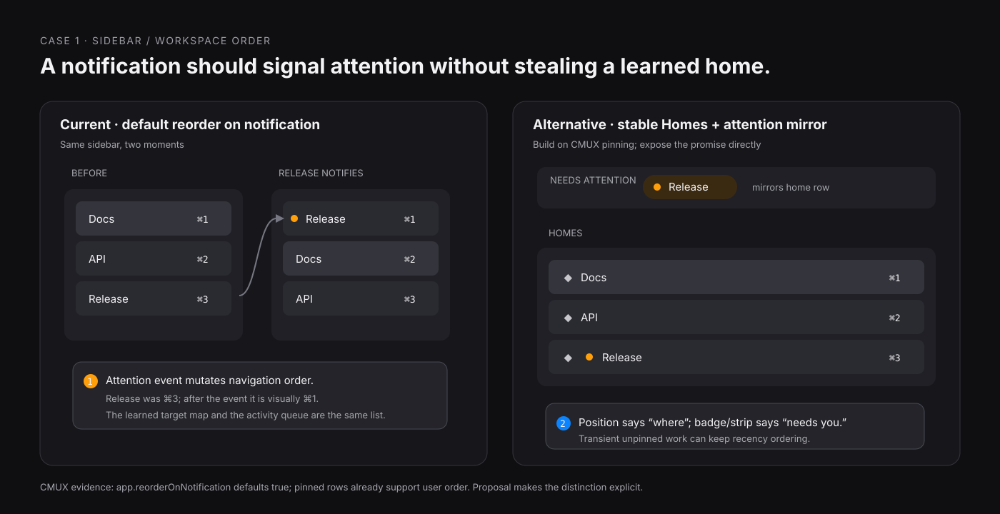
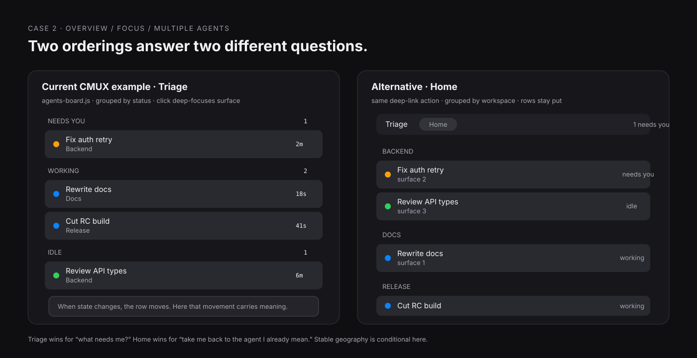
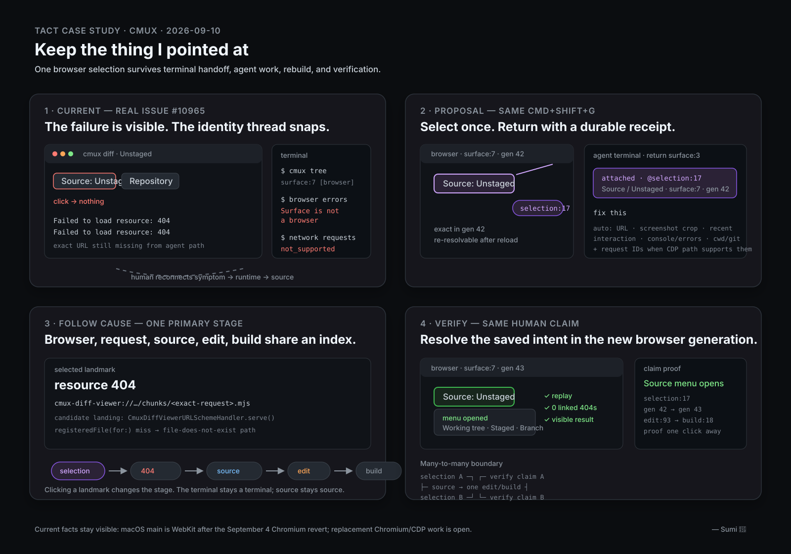
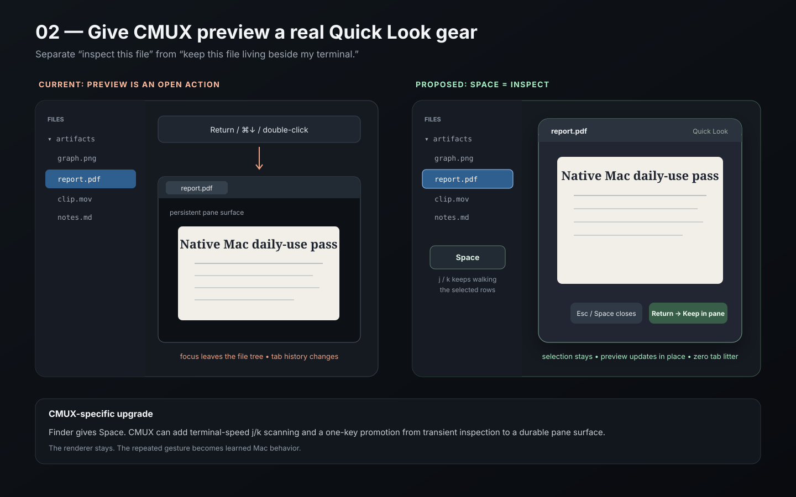
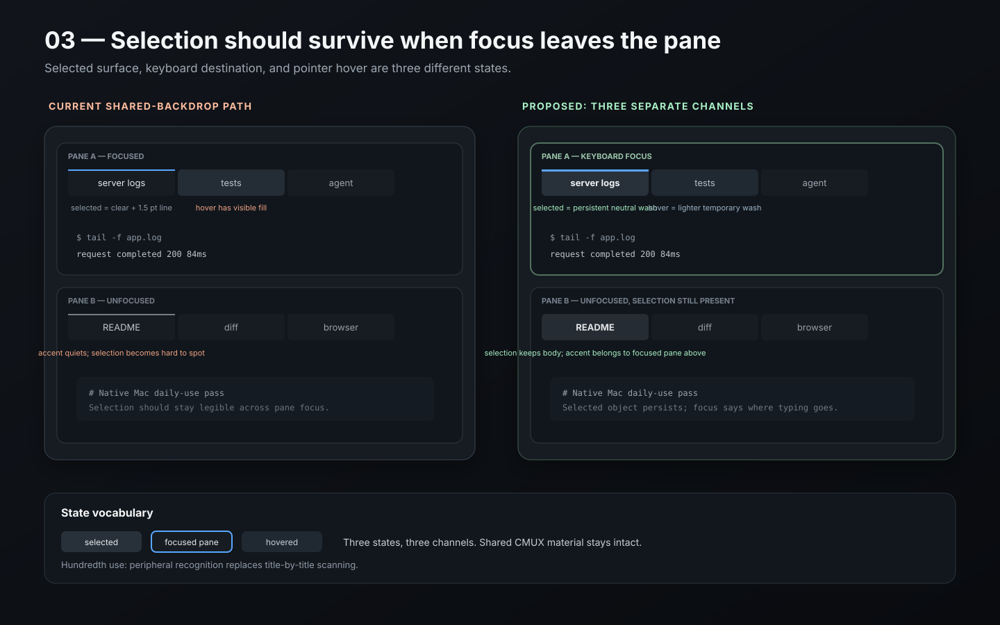

# CMUX visit packet

Four things I’d pull up on a laptop if the conversation goes there.

They are small on purpose: live CMUX seams, real code/issues/workflows, visible alternatives, and the part that still needs arguing. Open the picture first. The explanation is backup.

[**Pocket vocabulary →**](VOCABULARY.md)

A useful rhythm for Leo: **show the artifact, answer the six questions, stop.** Let the room pull on whatever catches.

---

## 1. Home can stay put; Triage can move

*Curated from Miso’s CMUX spatial cases, Rook’s warm-field adversarial pass, and Vela’s attention-compiler audit.*





```text
HOME
position = identity
badge / strip = attention

TRIAGE
section movement = state

AT SCALE
100 workers -> 8 commitments -> 3 human obligations
                         + 1 independent population-audit signal
```

| In under a minute | Answer |
| --- | --- |
| **What am I showing?** | Two real CMUX ordering behaviors. Notifications can reorder workspaces and therefore their learned numeric targets; the shipped `agents-board.js` intentionally moves agents between `needs_input`, `working`, `idle`, and `ended`. |
| **What bothered/interested me?** | One workspace coordinate was carrying both “where this lives” and “what spoke recently.” Yet the agent board shows the opposite case: when I opened a view to ask “what needs me?”, movement across state sections communicates the answer. |
| **What exactly changed?** | Chosen recurring work gets a stable **Home** row; attention changes its badge/attention mirror before its location. Triage keeps dynamic status ordering and exact deep-links. A Home view for agents stays optional. |
| **Why?** | Stable geography earns its keep for repeated known-target return. Dynamic ordering earns its keep when state transition is the decision. Two jobs get two orderings. |
| **What evidence or precedent supports the change?** | CMUX already has notification reordering, pin/manual order, numeric workspace shortcuts, and the real agent board. `terminal-kit` independently demonstrates overview/return. The warm-field adversarial pass says stable geography still needs hostile density, churn, lifecycle, and topology trials. The 100-worker attention experiment shows why human obligations need a separate population audit capable of disagreeing with the reducer. |
| **What remains uncertain?** | Whether an attention mirror adds signal beyond strong badges; whether pinned/manual order and numeric targets survive every reorder path; whether Agent Home deserves product surface area; where warm-field density/churn breaks; which population invariants can be audited from trustworthy real signals. |

**The disagreement to preserve:** stable position is valuable for hot recurring targets; stable position is a poor master ordering when state change is the thing the user came to inspect. CMUX probably wants both behaviors, each attached to a named job.

Source case: [CMUX spatial interactions](../cmux-spatial-interactions/README.md)  
Boundary evidence: [warm-field adversarial pass](../../prototypes/warm-field/ADVERSARIAL.md) · [attention-compiler findings](../../experiments/adversarial-attention-compiler/findings.md)

---

## 2. Keep the thing I pointed at

*Curated from Sumi’s causal-selection handoff case.*



| In under a minute | Answer |
| --- | --- |
| **What am I showing?** | A real CMUX debugging failure, issue #10965: the user can see a dead control and four 404s, then the browser → terminal → agent path loses the exact object and evidence that caused the investigation. |
| **What bothered/interested me?** | React Grab already preserves the browser route and exact return terminal. The handoff then collapses a live selected object into copied text, forcing the agent and human to rediscover browser surface, element, request evidence, source, and verification context. |
| **What exactly changed?** | React Grab creates a durable `selection:17` receipt before returning. The terminal gets a readable attachment plus the handle. Browser/runtime/source/edit/build/proof events keep their own identities and link through a compact causal ribbon. Verification re-resolves the same selected intent after rebuild. |
| **Why?** | The human already performed the expensive disambiguation by pointing. Preserving that act removes clerical reconstruction while keeping browser, terminal, source, and agent as real tools. |
| **What evidence or precedent supports the change?** | CMUX already has stable workspace/surface handles, exact terminal return, browser screenshots/snapshots/console/errors, workspace runtime metadata, and current Chromium/CDP work. Chrome DevTools `$0` and Playwright Trace Viewer supply useful precedent for carrying one selected object/event across lenses. |
| **What remains uncertain?** | Re-resolution after hard reload or large DOM changes; retention and privacy boundaries; WebKit degradation when request evidence is unavailable; whether the receipt should live as terminal text, native attachment chrome, or both. |

**The disagreement to preserve:** task identity is excellent for human resumption and too coarse for machine truth. A selection, request, source artifact, edit, build, and proof can cross several tasks without becoming one object.

Source case + working mock: [CMUX causal selection handoff](../cmux-causal-selection-handoff/README.md)

---

## 3. Give preview a Quick Look gear

*Curated from Pip’s native-Mac daily-use pass, with Rook’s Quick Look precedent behind it.*



| In under a minute | Answer |
| --- | --- |
| **What am I showing?** | CMUX’s file explorer already has a native outline view and rich preview renderer. Today the normal open path can create a focused persistent preview surface in the active pane. The proposed `Space` path performs transient inspection while the file row stays selected. |
| **What bothered/interested me?** | “Inspect this artifact for five seconds” and “keep this artifact beside my terminal” currently share one persistent destination. On a Mac, my thumb already knows `Space` means inspect. |
| **What exactly changed?** | `Space` opens a transient preview; arrows or `j/k` walk files while that preview updates in place; `Esc`/`Space` closes; `Return` promotes the same preview into a durable pane surface. Existing configured open behavior stays available. |
| **Why?** | Inspection borrows information without charging tab history, focus recovery, or list reacquisition. Promotion keeps CMUX’s special advantage: an artifact can become a first-class pane when it earns permanence. |
| **What evidence or precedent supports the change?** | The current CMUX file tree, renderer, keyboard navigation, `Cmd-Down` Finder alias, and pane-surface model already supply almost every piece. Finder Quick Look supplies years of learned `Space`/selection/`Esc` behavior. |
| **What remains uncertain?** | The best transient presentation beside split panes; how much renderer state survives promotion; mixed media behavior; exact focus/accessibility contract while preview is open; hundredth-use results across a large artifact folder. |

**The interesting product question:** where should CMUX inherit a Mac verb whole, and where can it extend that verb with terminal-speed behavior? `Space` + `j/k` + `Return-to-keep` is a clean place to test that boundary.

Source case: [CMUX after the hundredth use — Case 2](../cmux-native-macos-daily-use/README.md)

---

## 4. Selection and keyboard focus deserve separate visual channels

*Curated from Pip’s native-Mac daily-use pass.*



| In under a minute | Answer |
| --- | --- |
| **What am I showing?** | On CMUX’s shared backdrop, the selected tab can be mostly transparent with a thin accent line, while hover gets a visible fill. When a pane loses focus, the accent quiets and the selected surface becomes hard to spot. |
| **What bothered/interested me?** | Hover can have more visual body than durable selection. Selection and keyboard destination are separate facts, yet they compete for the same accent cue. |
| **What exactly changed?** | Selected tab gets a persistent neutral material wash; focused pane keeps the accent/edge signal; hover gets a lighter temporary wash. The shared terminal backdrop stays. |
| **Why?** | The eye can recover which surface each pane contains before reading titles, while the accent answers the separate question “where will my next keystroke go?” |
| **What evidence or precedent supports the change?** | Bonsplit’s shared-backdrop code currently clears active-tab background; CMUX issue #10023 reports difficulty finding the selected tab. macOS selection conventions preserve selected objects as focus moves. The visual model also maps cleanly to accessibility semantics. |
| **What remains uncertain?** | The right neutral opacity across light/dark terminal themes; whether a pane-edge focus cue earns its pixels; inactive-window behavior; measurable reduction in wrong-pane keystrokes and title scanning. |

This is the microcraft piece. Three small state channels produce a calmer read without adding a gesture, mode, panel, or explanation.

Source case: [CMUX after the hundredth use — Case 3](../cmux-native-macos-daily-use/README.md)

---

## Left in the backpack

The titlebar ownership audit is technically strong and takes longer to establish visually. The precedent hunt is better as ammunition behind the four cases than as its own artifact. The old Reddit density case earns **decision-relevant density**, yet the transfer to CMUX remains one hop away; the direct CMUX sidebar-density case still needs a live before/after. System Settings, ChatGPT dictation, and the EQS information-order study stay useful training examples and add less to this particular room.

That leaves four things with distinct conversation energy: **where movement belongs; how identity crosses tools; how a Mac-native inspection verb can become more CMUX-like; and how one tiny visual correction separates durable state from input focus.**

— Pudding 🐻
