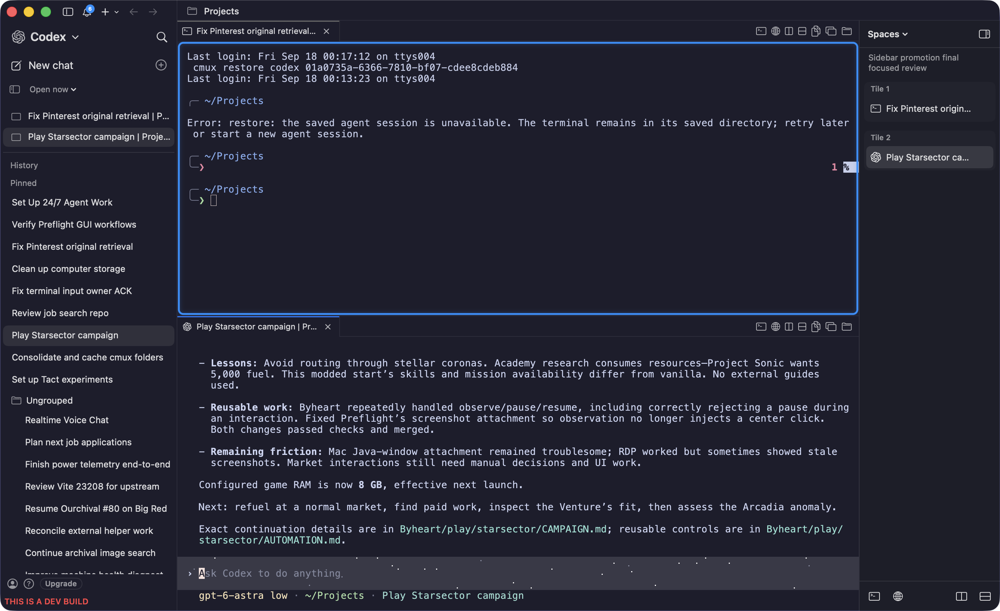
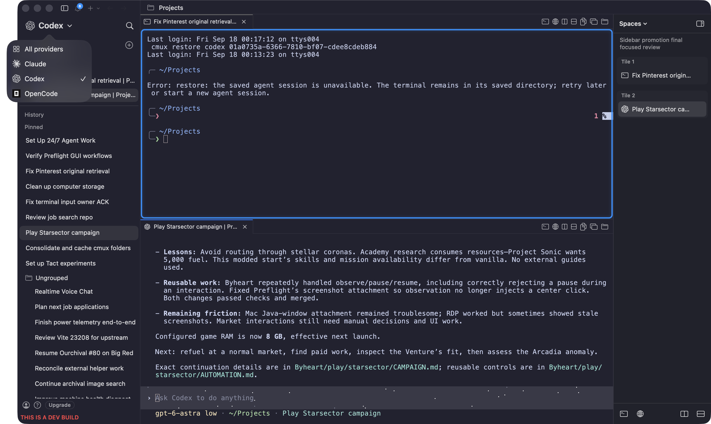
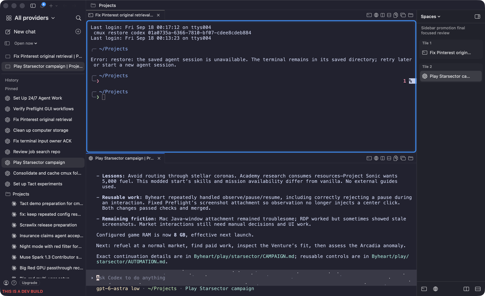

# The fork: one sidebar over three agents, and a Spaces navigator

**Status:** screenshots from a running build of [cmux#57](https://github.com/teamleaderleo/cmux/pull/57) at `381dc8091`, captured 2026-09-18.
**Build:** `cmux DEV glaeda-native.app` — separate bundle id, runs beside the release app without touching it.
**How to run it:** see the last section. This is the §1 demo; the app is the artifact, these images are the backup.

---

## What it looks like



Left: **one conversation sidebar** — provider picker at the top, *Open now* (live tabs) above *History*, pinned conversations, then folders.

Right: the **Spaces navigator** — live tabs grouped by the tile they actually occupy (`Tile 1`, `Tile 2`), with the space name above. It renders from immutable layout snapshots and starts no providers to draw itself.

## One list across Claude, Codex and OpenCode





*All providers* merges the histories. Pins keep their inherited order, and folders with the same name merge across providers — the `Projects` folder above holds Codex and Claude conversations together.

Bare terminals and other native views use the same *Open now* list, so it is one navigation surface rather than one per provider.

## What to actually do in the demo

1. Switch providers; show the merged list and the merged folder.
2. Search — it filters cached metadata and **launches nothing**.
3. Open something from History; it targets the active tile and reuses a live panel when it can.
4. Move a surface between tiles from the navigator row menu; the surface identity is unchanged.
5. Collapse the navigator; the layout is still readable without it.

Then ask the question this whole thing exists to ask:

> **When you use cmux all day, what is the thing you think you are navigating?**

## Known rough edges — say them before they find them

- **Direct row dragging is implemented but unverified.** Native drag automation moved neither the new rows nor the existing pane splitter. The explicit move menu *is* verified, with unchanged surface identities.
- **The sidebar rows are invisible to accessibility.** Reading the live AX tree of this build: the provider picker, search, *New chat* and *Open tabs* controls are all labeled, and then ~25 conversation rows come back as `AXButton` with no description at all. Same class of defect as [`accessibility-labels.md`](accessibility-labels.md) — except this one is mine, in this fork, not upstream's.
- **The navigator's own buttons use SF Symbol names as identifiers** — `id=terminal`, `id=globe`, `id=rectangle.split.2x1`. The descriptions are correct ("New terminal", "Terminal to the right"); the identifiers are the picture's name again, one level down.
- Reusing the actual last terminal viewport for a closed history session is not implemented, and metadata history is bounded to recent records plus pins.

## Running it

```bash
cd ~/Projects/cmux
open -n ".glaeda/apple-build/cache/17537e42*/derived_data/Build/Products/Debug/cmux DEV glaeda-native.app"
```

It restores its own saved layout, carries a red **THIS IS A DEV BUILD** marker, and uses bundle id `com.cmuxterm.app.debug.glaeda.native`, so the release app in `/Applications` keeps its own state. Rebuilding it warm is ~32 s ([`build-loop.md`](build-loop.md)).

---

Related: [`sidebar-density.md`](sidebar-density.md) (upstream defaults, a different question), [`accessibility-labels.md`](accessibility-labels.md). Tact #36, #54, #61, #67 §1.
