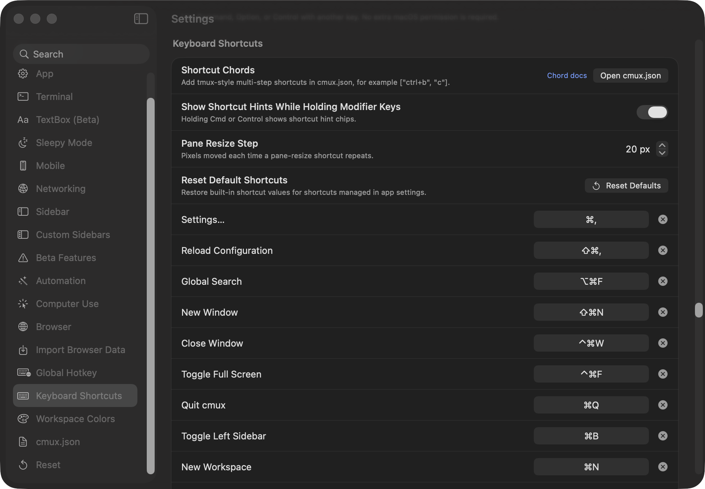

# Shortcuts: a corrected negative result

**Status:** measured against `manaflow-ai/cmux` at `e9ec596d1`, 2026-09-17.
**Method:** static extraction from `ShortcutAction+Defaults.swift`, `KeyboardShortcutActionContext.swift`, `ShortcutWhenClause.swift`, `Sources/AppDelegate.swift`. Read-only.
**Reproduce:** [`evidence/shortcuts.py`](evidence/shortcuts.py).

> An earlier draft of this page claimed cmux had 13 undeclared chord collisions resolved only by statement order, with no test and no UI signal. That was wrong. cmux implements the VS Code `when`-clause model. The page is kept because the correction is the useful part.

---

## What is measurable

**128 default chords over 43 keys.** 114 distinct, so 13 chords carry two actions (27 actions total). 70 of 114 chords need two or more modifiers.

`[` and `]` each carry seven actions across six modifier depths:

```text
]   cmd            focusHistoryForward        cmd+shift+opt   moveSurfaceRight
    cmd            browserForward             cmd+shift+ctrl  moveSurfaceToNextPane
    cmd+ctrl       nextSidebarTab             cmd+opt+ctrl    moveWorkspaceDown
    cmd+shift      nextSurface
```

## What cmux already does with it

**Every action declares a context.** `KeyboardShortcutActionContext.swift` maps each action to a `ShortcutContext`, and each context to a `ShortcutWhenClause` built from a real algebra:

```swift
case .nonBrowserPanel:     return .and(.not(.atom(.browserFocus)), .not(.atom(.sidebarFocus)))
case .outsideBrowserPanel: return .not(.atom(.browserFocus))
case .viewerPanel:         return .or(.atom(.browserFocus), .atom(.markdownFocus))
```

`matchConfiguredShortcut(event:action:)` evaluates the clause *before* matching the stroke, so **9 of the 13 collisions are mutually exclusive by construction**:

| chord | one side | the other |
| --- | --- | --- |
| `cmd+r` | `browserReload` · browserPanel | `renameTab` · nonBrowserPanel |
| `cmd+[` | `browserBack` · browserPanel | `focusHistoryBack` · outsideBrowserPanel |
| `cmd+=` | `browserZoomIn` · browser/editor | `markdownZoomIn` · markdownPanel |
| `ctrl+n` | `commandPaletteNext` · palette visible | `diffViewerScrollDownEmacs` · viewerPanel |

**The remaining four are deliberate and documented in source.** One side is `.application` (→ `.always`), and the overlap is resolved by conditional consumption:

```swift
if matchConfiguredShortcut(event: event, action: .groupSelectedWorkspaces) {
    // ... default ⌘⇧G collides with React Grab and grouping returns
    // false when no multi-selection exists.
    if handleGroupSelectedWorkspacesShortcut(...) { return true }
}
```

**Collisions are detected, tested and refused.** `ShortcutWhenClause.bindingsCollide` does priority-aware, most-specific-wins overlap detection, cites VS Code in its own docs, names the `⌃1` pair the first pass flagged, and refuses to save a **dead binding** — a clause implied by the winner's, which could never fire. `ShortcutListModel.detectConflict` rejects the rebind and raises a banner in Settings. Tests in `ShortcutWhenClauseTests.swift`. `shortcuts.when` in `cmux.json` has a real parser; unknown context keys parse to always-false, again matching VS Code.

## The Settings screenshot



An earlier pass captioned this "no collision indicator." Wrong reading: the indicator is a rejection banner raised when you attempt a colliding rebind, so it is not visible in a resting pane.

What is fair: at rest, the list does not show which chords are shared or which context governs them. The system knows and acts on it; the list does not display it until you trip it.

## What survives

1. **Modifier depth is a learnability question, not a correctness one.** Seven actions on `]` across six depths is real, and resolved correctly.
2. `handleCustomShortcut` is 1,749 lines, but its 622-line ordered prologue is *input-state* precedence — IME marked text, modal and sheet suppression, palette arming, escape suppression — not collision resolution. The size argument belongs to [`appdelegate-ownership.md`](appdelegate-ownership.md), not here.

## The method failure

The first pass reasoned from one screenshot and one function to a conclusion about the whole system. `bindingsCollide`, `ShortcutWhenClause` and `shortcutContext` were each one `grep` away. Do not assert a mechanism is absent without searching for it.

## The question for the room

The correctness question is closed. The open one is about teaching:

> **Is the `[`/`]` modifier family a designed accelerator users should be taught, or where actions go when the namespace is full?**

`showModifierHoldHints` reveals chips while Cmd or Control is held, which suggests designed. If so, "`[`/`]` is always previous/next, the modifier picks *which* thing" is a one-sentence model the flat list does not convey.

---

Related: [`appdelegate-ownership.md`](appdelegate-ownership.md), [`default-config.md`](default-config.md). Tact #59 (corrected), fieldwork #948 (closed as a negative result).
