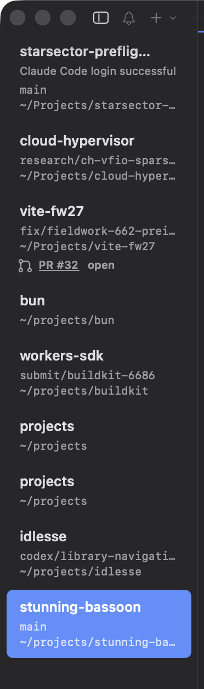
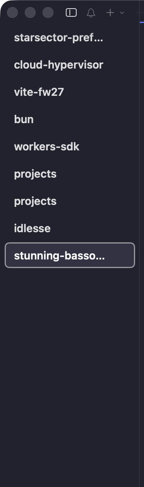
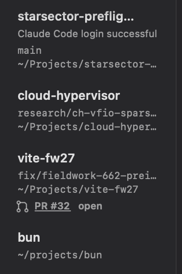

# Default sidebar detail: same nine workspaces, twice the height, one unanswered question

**Status:** captured 2026-09-17 from one running cmux instance, same window, same nine workspaces, same moment. Only `~/.config/cmux/cmux.json` changed between the two frames.
**Method:** `tk customization off` → capture → `tk customization on` → capture. cmux picks up the config change on its own; the window was never moved, resized, or raised. Config verified byte-identical to its pre-experiment state afterwards.

---

| cmux defaults | the same list, detail off |
| --- | --- |
|  |  |

Nine workspaces. On the left they fill the visible sidebar; on the right they use about 40% of it.

## The user job

Find the workspace you want and click it, many times an hour, without reading.

## What the default adds, line by line

Every row gains up to three subordinate lines: last notification message, Git branch, and working directory. That is `sidebar.showNotificationMessage`, `sidebar.showBranchDirectory`, and `sidebar.watchGitStatus` — all three default to `true`, along with six more `show*` flags ([`default-config.md`](default-config.md) has the full nine).

Look at what those lines actually say in a real session:



Three specific things are worth pointing at, and none of them is "it's too dense."

### 1. A transient status became permanent row furniture

The first row's subtitle is **"Claude Code login successful."**

That was true once, for a few seconds, some time ago.

This is not just an inference from the screenshot — the path is unconditional in source. `TerminalNotificationStore.latestNotification(forTabId:)` returns `indexes.latestByTabId[tabId]` with **no read filter**, and that feeds `latestNotificationText` on the row snapshot (`TerminalController+ControlSystemContext.swift`). Marking a workspace read does not clear it: `markRead(forTabId:)` sets `isRead = true` on each notification but leaves it in the store, so `latestByTabId` still resolves. Only an explicit `clearLatestNotification(forTabId:)` / removal drops it.

So a row's most prominent secondary text is whatever last happened to fire, and it stays after you have read it. For a healthy workspace that is usually the least interesting thing about it — and a workspace that is fine shows the same kind of message as one that needs you.

This is Tact #52's thesis meeting a real default: **healthy activity should be quiet**, and this is the shape of it not being quiet.

### 2. The detail does not disambiguate the one row that needs it

Two rows are titled `projects`. In the default view they are:

```text
projects            projects
~/projects          ~/projects
```

The extra line costs vertical space on all nine rows and, for the only pair where identity is genuinely ambiguous, **adds nothing** — both render identically. The user still cannot tell them apart, and now it takes twice the space to not tell them apart.

Whatever actually distinguishes those two workspaces — window, creation time, what is running in them — is not what the row shows.

### 3. Almost every detail line is truncated

`starsector-preflig…`, `~/Projects/starsector-…`, `research/ch-vfio-spars…`, `~/Projects/cloud-hyper…`, `codex/library-navigati…`, `~/projects/stunning-ba…`.

The information most likely to disambiguate — the *end* of a path, the *end* of a branch name — is the part that gets cut. Branch names are usually distinguished by their suffix (`fix/fieldwork-662-prei…`), and paths by their tail. Head-truncation would be more useful than tail-truncation here, and neither is as useful as not showing the line.

A smaller thing, visible once you look: paths render as both `~/Projects/…` and `~/projects/…` in the same list. That is macOS's case-insensitive filesystem faithfully reporting how each workspace was opened, which is correct and still reads as an inconsistency.

## The seam

These nine booleans are not nine preferences. They are one question — *is this list a navigation control or a status dashboard?* — and the product currently answers "both, by default, always."

The default answers "dashboard." The right answer for the job in the first line of this document is "navigation control." That is why every `show*` flag in this fork's config is off, and why `terminal-kit` ships named `quiet` / `details` presets rather than asking anyone to make nine independent decisions.

## The precedent

Finder, Mail, Xcode, and every IDE project navigator converge on the same answer: **the list is compact by default, and detail is a mode you enter deliberately** — Finder's list vs gallery view, Mail's preview-line count, Xcode's filter bar. None of them make per-attribute visibility the primary control.

The interesting divergence is that cmux has something those do not: rows whose *state changes on its own* while you are not looking. That is a genuine reason to show more than Finder does. It is an argument for showing **attention state** — this one needs you, this one does not — rather than for showing branch and path.

## The proposal

1. **Ship density presets** (`quiet` / `default` / `detailed`) as the primary control; keep the nine booleans as the escape hatch beneath them.
2. **Decay notification text.** A row's last notification should stop being its subtitle once it is read or old. "Login successful" from an hour ago should not outrank the workspace's name.
3. **Make disambiguation a real feature, not a side effect of showing paths.** When two rows would render identically, show what actually differs.
4. **Truncate from the head** on paths and branches, where the distinguishing characters live.

Items 2–4 are small and independent. Item 1 is the one that matters.

## The unresolved question for the room

> **Is the workspace list meant to be glanceable furniture, or a status surface you read?**

If it is furniture, the defaults are inverted and #1 above is the fix. If it is a status surface, then the row should be showing attention state and not branch/path, and the interesting build is a different one — closer to Tact #55's decision cards than to more boolean flags.

This cannot be answered from outside. It depends on how the founding team actually uses their own sidebar, which is question one in Tact #53 §1.

---

## Related

- [`default-config.md`](default-config.md) — all 29 overridden defaults and the cluster structure.
- Tact #23 (compress a sidebar without losing hierarchy), #55 (attention triage decision cards), #52 (quiet healthy work).
- terminal-kit [`config/cmux/sidebar-presets.json`](https://github.com/teamleaderleo/terminal-kit/blob/main/config/cmux/sidebar-presets.json).
