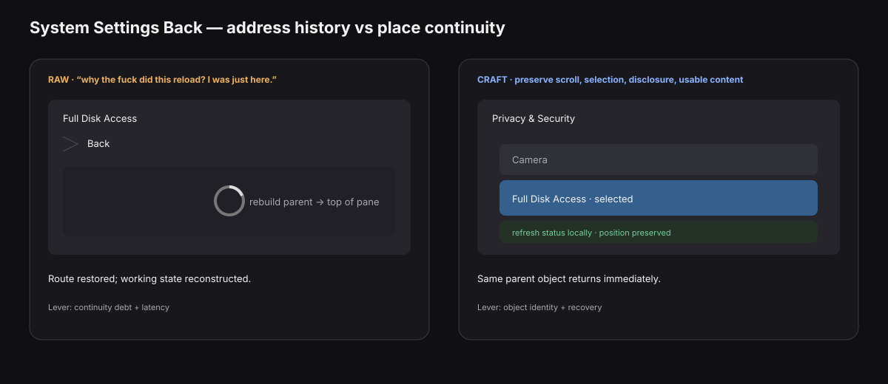
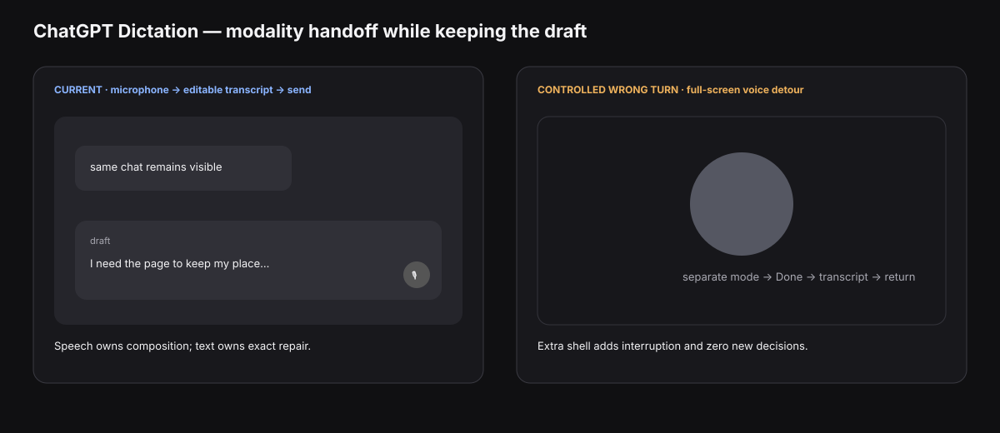
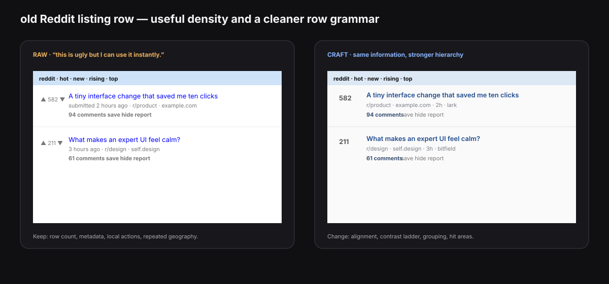
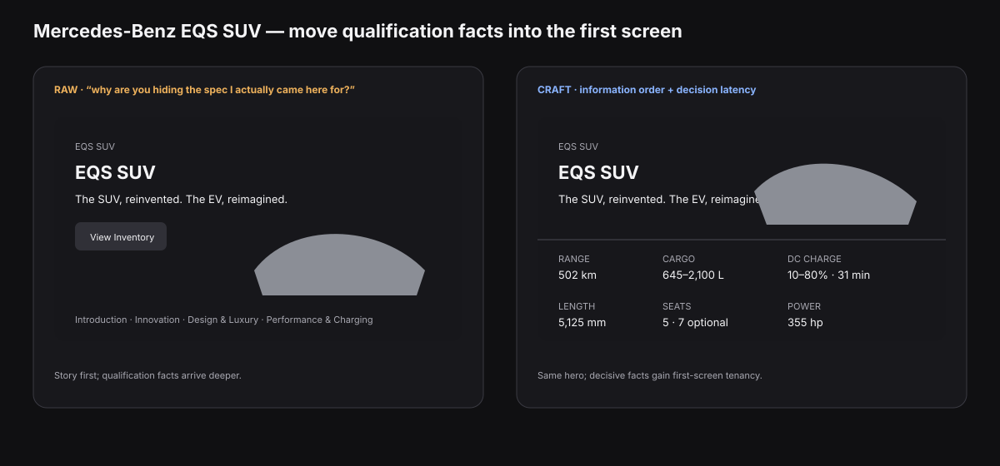

# Everyday interface microcases: RAW -> CRAFT

Checked against live/public product behavior and documentation on 2026-09-10. This pass stays outside CMUX on purpose.

Four cases survived the cut because each teaches a different lever using products Leo already uses or has a strong recorded reaction to:

1. **System Settings Back** — continuity, object identity, latency, recovery.
2. **ChatGPT Dictation** — modality, attention routing, feedback, local repair.
3. **old Reddit listing rows** — density, hierarchy, learned fluency, stable targets.
4. **Mercedes-Benz EQS SUV category page** — information order, progressive disclosure, decision latency.

Open [`prototype.html`](prototype.html) locally for the interactive comparison. The SVGs render directly in GitHub. They are schematic interaction studies built to isolate the decision.

The method follows [`APPLIED.md`](../../APPLIED.md): keep the first judgment alive, then add enough craft language to identify the lever and build a controlled alternative.

---

## 1. System Settings Back: return to the place with its working state



### Context

**Product:** macOS System Settings  
**Interaction:** `Privacy & Security -> Full Disk Access -> Back`  
**Job:** inspect one permission, then return to the exact place in the parent pane and continue.

Apple documents Back/Forward as history over recently viewed settings, including a press-and-hold history list. Tact already records Leo's sharper complaint: some Settings journeys feel reconstructed on return, with waits or reloads that expose an implementation boundary.

**Evidence boundary:** the exact reload/scroll-reset behavior varies by pane and OS build. The controlled mock isolates the failure class Leo is reacting to; live use should record which concrete panes still exhibit it.

Sources: [Apple — Go back to system settings you viewed earlier](https://support.apple.com/en-gb/guide/mac-help/mchldfdf4f86/mac), [`notes/native-macos-daily-use.md`](../../notes/native-macos-daily-use.md), [`notes/leo-interface-instincts.md`](../../notes/leo-interface-instincts.md).

### RAW

> “why the fuck did this reload? I was just here.”

The sentence already contains the useful clue: **“I was just here.”** The user thinks of the parent pane as a place that still exists.

### CRAFT

The failure is **continuity debt** during back navigation.

Back communicates return to a prior view. If the prior pane comes back with a blanking interval, reset scroll position, collapsed disclosures, or a lost selection, the interface preserves the route while discarding the state that made the route useful.

The relevant terms are:

- **object identity:** the parent pane should read as the same pane the user left;
- **spatial memory:** scroll position and the selected row are part of the user's remembered location;
- **stable targets:** the row used to enter the child should remain visually recoverable on return;
- **latency:** whole-pane replacement turns background refresh into foreground waiting;
- **feedback:** stale values can signal refresh locally while the old pane stays legible;
- **recovery:** Back should restore the user's exact continuation point with one action.

A compact diagnosis:

> Navigation history preserves the address. Good return behavior preserves the working state attached to that address.

### Concrete alternative

Treat the previous pane as a resident view for the duration of the navigation stack.

On Back:

```text
child pane
-> previous pane appears immediately at prior scroll offset
-> prior selection remains visible
-> expanded rows remain expanded
-> changed values refresh in place
```

The prototype deliberately gives the current side a 650 ms whole-pane reconstruction and scroll reset. The alternative returns immediately, keeps the selected `Full Disk Access` row in view, then updates one stale value locally.

Try **Case 1** in [`prototype.html`](prototype.html).

### Judgment

**Keep:** Back/Forward history and the visible arrow model.  
**Change:** restore scroll, selection, disclosure state, and usable cached content before refresh.  
**Reject:** whole-surface blanking for ordinary return navigation.  
**Unresolved:** which 2026 System Settings panes still pay this cost in live use, and which state can safely persist across permission changes.

### Vocabulary earned

“I hate this reload” becomes:

> “Back incurred continuity debt because the parent view lost spatial state and exposed refresh latency as a whole-surface transition.”

---

## 2. ChatGPT Dictation: speech carries composition, text carries repair



### Context

**Product:** ChatGPT  
**Interaction:** microphone dictation in the message composer  
**Job:** say a long or messy thought quickly, inspect the transcription, fix one exact word if needed, send.

OpenAI's current Dictation FAQ describes the hot path clearly: press the microphone icon, record audio, receive a text transcription, edit it, then send it as the user message. ChatGPT Voice is a separate conversational mode; this case stays on the one-shot dictation interaction because the design lesson is unusually clean.

Source: [OpenAI — Voice Dictation FAQ](https://help.openai.com/en/articles/12168547-voice-dictation-faq), [`notes/voice-multimodal-and-disappearing-interfaces.md`](../../notes/voice-multimodal-and-disappearing-interfaces.md), [`notes/leo-interface-instincts.md`](../../notes/leo-interface-instincts.md).

### RAW

> “I stopped looking at the screen. I just talked and the thought showed up as text.”

### CRAFT

This is a strong **modality handoff** because each medium gets the part it handles well.

- **speech** carries open-ended composition and low-friction intent;
- **text** carries inspectability, exact spelling, names, numbers, quoting, and local repair;
- **continuity** stays high because the result lands in the same conversation and composer;
- **attention routing** lets the screen recede during composition, then invites a brief visual check at the right moment;
- **feedback** only needs to answer “am I recording?” and “what did you hear?”;
- **recovery** can be local: edit one wrong token instead of repeating the thought.

The useful quality is the low **modal depth**. Dictation behaves like another input method for the same draft object.

A compact diagnosis:

> The interface disappears during composition because speech owns expression, then returns as editable text exactly when precision becomes valuable.

### Controlled alternative: make dictation unnecessarily modal

Turn one-shot dictation into a full-screen voice session:

```text
composer
-> full-screen voice shell
-> talk
-> end session
-> wait for transcript
-> return to composer
```

This controlled wrong turn adds a representation change and zero new user decisions. The same draft acquires a second shell, a second exit action, and a return transition.

Try **Case 2** in [`prototype.html`](prototype.html): both variants produce the same sentence. One keeps the draft object in place; the other moves the user through an extra mode.

### Judgment

**Keep:** microphone -> editable transcript -> send.  
**Change:** keep recording feedback tiny and make correction land directly in the draft.  
**Reject:** a full-screen mode transition for one-shot dictation.  
**Unresolved:** how much transient transcription should appear while the user is still speaking, especially when early text could pull attention back to the screen.

### Vocabulary earned

“I stopped looking at the screen” becomes:

> “The input mode reroutes composition to speech while preserving the draft's identity; visual attention returns only for inspectability and exact repair.”

---

## 3. old Reddit listing rows: density is useful when the row already answers the next questions



### Context

**Product:** `old.reddit.com` on desktop  
**Interaction:** scan a feed row and decide whether to open the post, open comments, keep scanning, save, hide, or inspect the source/community.  
**Job:** evaluate many candidate posts quickly in one listing.

The current old Reddit front page still places title, source/domain, subreddit, age/submitter metadata, comment count, save, hide, and report controls directly in the listing. The page exposes dozens of candidate objects at once.

Sources: [old.reddit.com](https://old.reddit.com/), [`notes/leo-interface-instincts.md`](../../notes/leo-interface-instincts.md), [`WORKBENCH.md`](../../WORKBENCH.md).

### RAW

> “this is ugly but I can use it instantly. I want all this shit visible.”

### CRAFT

The useful property is **decision-relevant density**.

A listing row answers several likely follow-up questions in the listing itself:

```text
what is it?
where is it from?
which community?
how old?
how much discussion?
what can I do with it?
```

That creates:

- **scan compression:** more candidate decisions fit in one viewport;
- **stable targets:** score, title, metadata, and actions occupy repeated positions;
- **learned fluency:** the eye learns the row grammar and skips low-value fields automatically;
- **local action:** comments/save/hide live beside the object they affect;
- **hierarchy:** title leads, metadata recedes, action text sits in a repeatable lower tier;
- **low navigation tax:** many questions resolve in the list itself.

The visual roughness and the useful density are separate variables. A contemporary polish pass can improve one while preserving the other.

### Concrete alternative: keep every useful field; improve the row grammar

The alternative keeps the same information and nearly the same row height. It changes four things:

1. score becomes a fixed-width numeric column;
2. title/domain share one clear first line;
3. author/community/time form one quieter metadata line;
4. comments/save/hide/report form one consistent action line with larger hit areas.

The object stays a compact listing row: four comparable posts remain visible, metadata stays present, and common actions stay local.

Try **Case 3** in [`prototype.html`](prototype.html): switch between rough and polished rows while the viewport keeps the same four posts visible.

### Judgment

**Keep:** dense rows, visible metadata, local actions, repeated geography.  
**Change:** hierarchy, hit areas, alignment, and contrast tiers.  
**Reject:** cardification that reduces the number of comparable posts or hides common row facts behind disclosure.  
**Unresolved:** the density threshold on smaller screens, touch input, and serial accessibility modes.

### Vocabulary earned

“This is ugly but I can use it instantly” becomes:

> “The page has high decision-relevant density, strong scan compression, and a learned row grammar; visual finish can improve while preserving the low navigation tax.”

---

## 4. Mercedes-Benz EQS SUV: let the hero sell the car and answer the first buying questions



### Context

**Product:** Mercedes-Benz Canada EQS SUV pages  
**Interaction:** arrive at the EQS SUV category page while evaluating the vehicle, then hunt for decisive facts.  
**Job:** learn whether the car fits the buyer's requirements before investing attention in feature storytelling.

The live EQS SUV category page opens with the product name, a slogan, inventory/build actions, and story sections such as Introduction, Innovation, Design & Luxury, and Performance & Charging. The specific EQS 450 4MATIC model page exposes a far richer decision layer: passenger capacity, cargo, exterior dimensions, battery, charging, range, acceleration, and more.

This is a particularly clean teaching case because the same brand already contains both presentation modes.

Sources: [Mercedes-Benz Canada — EQS SUV category](https://www.mercedes-benz.ca/en/vehicles/class/eqs/suv), [EQS 450 4MATIC SUV model](https://www.mercedes-benz.ca/en/vehicles/model/eqs/suv/eqs450x4), [`notes/information-first-product-pages.md`](../../notes/information-first-product-pages.md), [`notes/leo-interface-instincts.md`](../../notes/leo-interface-instincts.md).

### RAW

> “why are you hiding the spec I actually came here for? I already know the car looks expensive.”

### CRAFT

The issue is **information order** for an evaluation task.

The opening spends attention proving category-level desirability while several decision-changing facts live deeper in the model layer. This raises **decision latency** even when the page itself loads quickly.

The relevant terms are:

- **attention routing:** the hero pulls focus toward brand story before qualification questions resolve;
- **information hierarchy:** slogan and imagery outrank range, dimensions, cargo, charging, price/availability, and variant differences;
- **progressive disclosure:** deeper specs exist, but the opening gives a weak contract for how quickly they can be reached;
- **consequence:** vehicle evaluation involves fit, money, ownership, and technical constraints; decisive facts deserve early tenancy;
- **mode mismatch:** a category-discovery page and a model-evaluation page serve different jobs, yet an already-interested buyer can land on the category page first.

A compact diagnosis:

> The page routes attention through aspiration before resolving the facts that qualify the product for serious consideration.

### Concrete alternative: add a first-screen decision strip

Keep the hero photography and model identity. Directly beneath them, add one compact rail:

```text
From / inventory
Range
Cargo
Length x width
DC charge 10-80
Seats
Compare models   Full specs
```

The strip links into the existing model/spec content. It changes page order instead of rewriting the brand voice.

Try **Case 4** in [`prototype.html`](prototype.html): the current version makes the decisive fields appear after “scrolling”; the alternative exposes them beside the first buying action.

### Judgment

**Keep:** hero photography, visual character, model identity, build/inventory paths.  
**Change:** give decisive specs and variant comparison first-screen tenancy.  
**Reject:** forcing an evaluation user through several story chapters before fit can be checked.  
**Unresolved:** which six facts deserve the strip for each vehicle category and market, and how the rail adapts when price/availability data is incomplete.

### Vocabulary earned

“Why are you hiding the spec?” becomes:

> “The information order increases decision latency by routing attention through promotional narrative before exposing qualification facts.”

---

## What these four cases add to Tact

They sharpen four existing instincts into testable language:

| RAW instinct | CRAFT translation | Controlled variable |
| --- | --- | --- |
| “I was just here.” | continuity + object identity + recovery | retained state on Back |
| “I stopped looking at the screen.” | modality handoff + attention routing + local repair | modal depth of voice input |
| “I want all this shit visible.” | decision-relevant density + scan compression + learned fluency | information kept in the row |
| “show me the spec.” | information order + progressive disclosure + decision latency | first-screen fact placement |

The recurring move is simple:

```text
reaction
-> name the user job
-> identify the lost/preserved state
-> name the lever
-> change one thing
-> inspect the tradeoff
```

These cases stay intentionally narrow. Each can be argued with by pointing at a specific transition, row, or information tier.

— Aster 🐐
