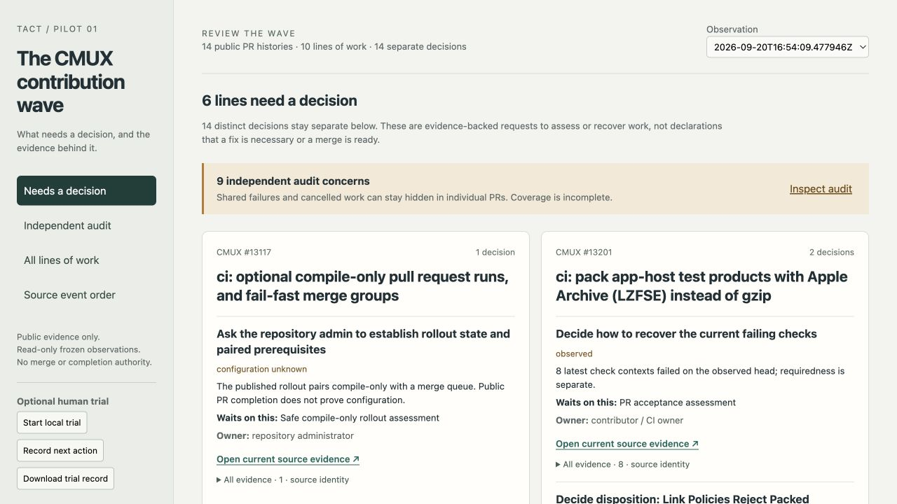
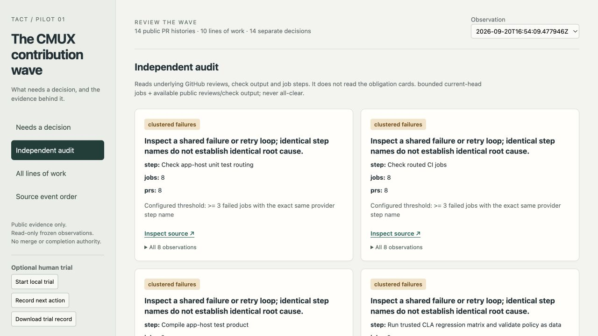

# CMUX attention pilot

A runnable, read-only pilot for [Tact #86](https://github.com/teamleaderleo/Tact/issues/86): **14 public PR histories → 10 lines of work → 14 distinct decisions on six lines**, with the same 14 decisions in a second live capture and fewer unavailable facts. It keeps independent review decisions separate instead of forcing the wave into three cards.

The useful first interaction is: find **#13210 → Workspace Target Is Lost**, inspect its reviewed head and owner, and follow its exact public review link. A separate audit shows shared failed steps and cancelled runner time without using the decision cards.



## Run

Python 3.10+ standard library only. No credentials, GitHub connection, package install or running CMUX required for replay.

```sh
cd experiments/cmux-attention-pilot
python3 replay.py evidence/cohort.json.gz evidence/live.json.gz --serve
# Open http://127.0.0.1:8766
python3 -m unittest -v test_pilot.py
python3 evaluate.py
python3 evaluate.py --reference reference-live.json
```

Without `--serve`, replay prints deterministic JSON. The observation selector switches complete snapshots; it does **not** manufacture historical thread state from today's resolved flags. The separate source-event index preserves available timestamps, original IDs and raw JSON pointers. Timestamp ties use PR and event ID for stable ordering, not asserted causality. Events with missing times remain explicitly undated.

To observe the **same cohort** again, use the installed authenticated `gh` CLI:

```sh
python3 collect.py /path/to/new-observation.json
python3 replay.py evidence/cohort.json.gz /path/to/new-observation.json --serve
```

The collector refuses to overwrite snapshots. It performs GET requests and read-only GraphQL queries; there are no review, comment, merge, rerun, dispatch or cancellation calls. It confirms the repository is public and excludes private/unverified cross-reference payloads. No local session, transcript, credential, build or machine receipt enters the cohort.

The HTTP server binds **127.0.0.1**, serves only `/` and `/data.json`, rejects POST and file traversal, and starts no jobs. UI actions open evidence, change views or download a local optional trial record. The human trial was deferred by the user; no trial data is included.

## Frozen cohort and relationships

Repository: `manaflow-ai/cmux`. Full identities, base/head SHAs, per-PR start/observation times, provider source timestamps, rules and request failures are in the gzip-compressed raw evidence. Gzip is lossless; `results.json` records compressed and uncompressed hashes.

| Line | Public histories | Scope |
|---|---|---|
| Trusted complexity prerequisite | #13114 | CI / admin prerequisite |
| Compile-only and queue rollout | #13117 | Explicitly depends on #13114 |
| Compiler state reuse | #13128 | CI/cache |
| Apple Archive test products | #13201 | CI/cache |
| Merge-group fail-fast | #13235 | CI/queue |
| Admission job pagination | #13240 | CI |
| Local tmux settings | #13042 → #13210 | Settings |
| Sidebar Settings discovery | #12981 → #13211 | Settings |
| Test wiring | #13053 → #13216 | Executed-test reliability |
| Control socket recovery | #12994 → #13229 | Lifecycle |

Replacement edges come only from explicit `Replaces https://…` statements in public PR bodies. Both originals and replacements stay in raw evidence. Their jobs are deduplicated by provider job ID and attempt in the audit. Closed originals do not generate duplicate current obligations. The #13117 dependency is a narrow reviewed extraction of its explicit “Admin-merge #13114” prerequisite; unrelated `#mentions` are not treated as dependencies.

Reviews retain commit IDs, authors, submission times, open/resolved/outdated thread facts and comments. Checks retain source SHAs, provider names/apps, conclusions and output. Runs/jobs retain event, run/attempt/job identities, steps and timing. The timeline contains **two queue admissions and one removal for #13117**, plus force-push, review, merge and replacement-related histories. These facts do not establish a complete queue ledger or a queue-to-job join.

The first observation spans 16:51–16:54 UTC on September 20, 2026 (exact bounds in `results.json`); the second finishes at 17:00:25 UTC. Both are multi-request observations, not atomic GitHub transactions. The collector rereads head and `updated_at`; detected drift replaces specific decisions with a recapture request. Changes invisible to those fields, edited/deleted historical bodies, incomplete >100-comment threads and unavailable endpoints remain limitations.

## What is a decision?

`model.py` emits a stable identity for each review finding, distinct requested-changes review, failing check recovery, explicit queue removal, and the documented paired admin rollout. Each has **action, why now, owner, what waits, head, observation time and source links**. A PR's check recovery groups contexts for the same contributor/CI-owner assessment; unrelated review findings remain separate. Generic downstream acceptance is labeled an assessment, not an invented dependency.

Latest checks are selected by provider app + check name on the observed head; a new pending or successful run supersedes an old failed context. An old-head open review stays a **revalidation** decision, not a claim that its diagnosis is still valid. Resolved/outdated threads disappear from the current decision view, while their histories remain. Resolution, successful tests, merge and provider completion are observations. Every line retains `completion: unknown`; this pilot does not create an acceptance authority or a second work ledger.

The real public rules response contains status-check requirements and no required-review rule. Classic branch-protection configuration was not collected. The UI therefore does not claim that review requirements are absent or satisfied. Admin variables, accepted rollout state, exact artifact identity and launched artifacts are unknown.

The earlier [PR-obligation prototype](https://github.com/teamleaderleo/Tact/pull/90) on PR #90 informed these conservative semantics. This pilot does not import that unmerged branch or duplicate its intended review-policy ownership; it adds the frozen cohort, replay, population audit and small interaction surface.

## Independent audit

`audit.py` imports no reducer code and reads **raw** review, check-output, job-step and comment facts. It can disagree with the reducer; tests poison reducer-like fields and exercise a quiet primary surface with stale approval, zero-test and clustered-job hazards.

| Signal | Observable fact / configured threshold | Qualification |
|---|---|---|
| Stale approval | ≥1 latest approval anchored to another head | Does not decide required-review satisfaction |
| Failure cluster | ≥3 jobs with identical failed step name | Coarse provider-step signature, **not** proven shared cause or retry |
| Zero tests | ≥1 literal `Ran 0 tests` / `Executed 0 tests` in check output | PR descriptions are not execution evidence |
| Cancelled work | ≥600 cancelled job wall seconds | Candidate waste; queue attribution, avoidability and money unknown |
| Provider limit | Explicit bot notices on ≥2 PRs | Historical notice; current availability/recovery unknown |

Six failure-step clusters, cancelled work and two provider-limit groups appear in the real initial capture: **9 concerns**. No real stale-approval or zero-test observation is claimed; those hazards have synthetic tests. Missing test counts never become zero. The first capture measured **10,733 cancelled job wall seconds** out of **75,161 observed job wall seconds**, with no extrapolation beyond the captured heads/available attempts. The initial independent path exposes failures on merged/replaced histories that the current decision surface intentionally leaves quiet.



Nine coarse concerns may be too noisy. Keep this as an inspection lens until trials justify thresholds; do not call it an interruption policy or an all-clear indicator.

## Owner exports (#82 / #83)

`exports.py` consumes `cmux-verification/v1` directly. The frozen public #83 example comes from [PR #91 at 10bd22e](https://github.com/teamleaderleo/Tact/blob/10bd22ea43deee076e4f54d2801d65e88fc6b08b/experiments/cmux-verification/examples/ci.json). Its exact provenance/hash is in `evidence/export-provenance.json`. It reports three executed tests in a passing step/job inside a failing workflow, with distinct PR and checkout merge SHAs.

Neither its head nor its job belongs to this frozen cohort. The UI exposes it under All lines → Rules and evidence coverage as **unjoined**; it does not add three tests to cohort coverage or change obligations/audit. Extra public exports may be supplied with `--verification-export`. Inputs must have the cohort repository and public evidence URL; joins require both head and job identity. This is supplemental evidence, never completion.

#82's public `metrics.json` and `cohort.json` are frozen from [PR #94 at 4d123a8](https://github.com/teamleaderleo/Tact/tree/4d123a87ecf3957bcc287bd80bb09ae7dc5cafaf/experiments/cmux-ci-receipts). `--ci-metrics` / `--ci-cohort` consume their fixed-window counts through an explicit allowlist. They appear as `different_cohort` supplementary context; their runner totals are never added to this PR-cohort's audit. Both published exports are bundled for offline replay; neither owner's ongoing work or completion is a startup dependency.

## CMUX host experiment

Inspected `teamleaderleo/cmux#57` at **4c190f2c5b302bd4df4f6f66753976e2b7a5b491**, including the custom-sidebar data context, JS runtime/scene actions, native action dispatch and the authoring guide. Existing facilities already support interpreted JavaScript scene files, `openURL`, file hot reload and `cmux sidebar open <name>`; the runtime intentionally has no filesystem/network/timers.

Generate a static native snapshot with:

```sh
python3 replay.py evidence/live.json.gz --sidebar attention-pilot.js > /tmp/attention-replay.json
# With a live supported CMUX instance, optionally install this owned file:
cp attention-pilot.js ~/.config/cmux/sidebars/tact-attention-pilot.js
cmux sidebar validate tact-attention-pilot --json
cmux sidebar open tact-attention-pilot
```

The committed generated example is `evidence/attention-pilot.js`. Its only actions open public evidence URLs. Regenerate the file to update the frozen timestamp and trigger the host's existing hot reload. It is a companion, not an independently live GitHub poller.

**Native rendering is unverified:** `cmux sidebar validate --json` found no live socket in this environment. No sidebar was installed or selected. The demonstrated surface is the loopback browser prototype. **No new CMUX API is required or justified by this result.** The absent socket is an environment/runtime prerequisite, not an upstream API gap.

## Evaluation boundary

`reference.json` and `reference-live.json` are explicit, source-linked, weighted decision logs reviewed by the **same implementation agent**, after inspecting raw evidence. They are non-blind and **not independently human-adjudicated**. They keep substantive P1 decisions separate and record excluded originals, merged work and resolved/outdated findings.

A first-version missing-job recovery card was rejected during source review as an unnecessary human chore; the gap remains in coverage. The final reproducible score is 0 weighted omissions out of 47 reference weight at each observation, 0 false obligations and 0 stale obligations at each corresponding observation. Tests deliberately remove a P1 decision (cost 5) and reintroduce a replaced original (false + stale) to show that the score detects those regressions. This does not measure unknown semantic omissions; reviewer findings may be wrong, and missing facts are listed explicitly.

The user deferred the human trial. Time to correct next action, unchanged-work checks, evidence drill-down frequency, total coordination time and superiority to the manual chat/GitHub stack are **unmeasured**. No reduction in cards is presented as a usability result. See the bounded future protocol in `RESULTS.md`.
