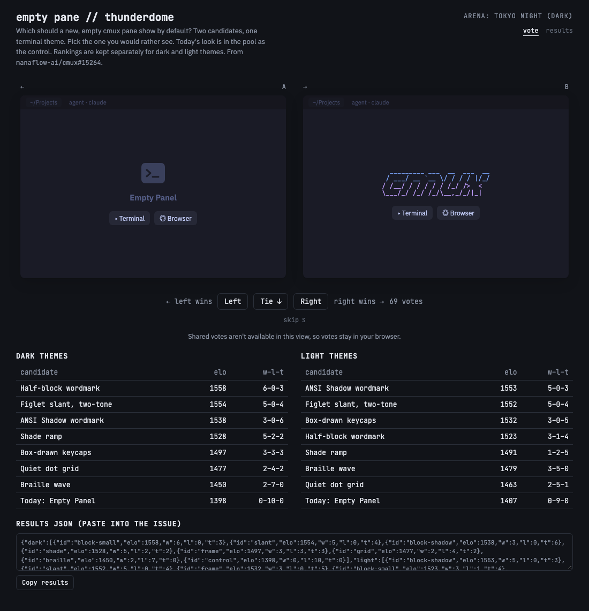
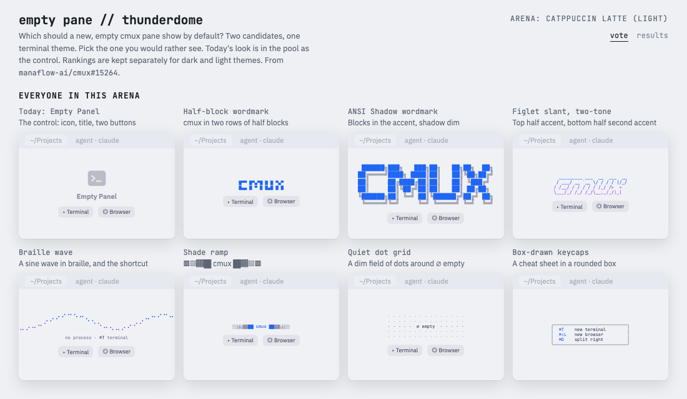

# cmux empty pane: results

## Context

A new cmux pane with nothing running in it shows "Empty Panel": a terminal icon, a title and two buttons. [manaflow-ai/cmux#15264](https://github.com/manaflow-ai/cmux/pull/15264) adds `emptyPane.artFile`, so a pane can show ASCII or ANSI art from a file instead. That raised the follow-up question of what the default should be when no file is set. This dome put eight candidates in the ring, today's look among them as the control.

Each bout showed two empty panes under the same random terminal theme, with candidate names hidden. There were seven themes, four dark (Ghostty default, Catppuccin Mocha, Tokyo Night, Gruvbox Dark) and three light (Catppuccin Latte, Solarized Light, GitHub Light), and the ratings were kept separately for dark and light.

The run happened on a one-off page (the design this engine's look now comes from). `config.js` here is the same dome ported to the engine, with the result stored as `demo.results` so `#demo` draws it.

## Contenders

| Candidate | What it shows |
| --- | --- |
| Today: Empty Panel | The control: icon, title, Terminal and Browser buttons |
| Half-block wordmark | `cmux` in two rows of half blocks, in the accent |
| ANSI Shadow wordmark | Six-row block letters, blocks in the accent and the shadow dim |
| Figlet slant, two-tone | Four-row slanted letters, top half accent and bottom half second accent |
| Braille wave | A sine wave in braille, and `no process · ⌘T terminal` |
| Shade ramp | `░▒▓█ cmux █▓▒░` |
| Quiet dot grid | A dim field of dots around `∅ empty` |
| Box-drawn keycaps | A rounded box listing ⌘T, ⌘⇧L and ⌘D |

Every candidate but the keycaps keeps the two buttons.

## First run (Leo, 2026-09-28, 69 votes)

Copied from the [result comment on #15264](https://github.com/manaflow-ai/cmux/pull/15264#issuecomment-5872567922):

| Candidate | Dark Elo | Dark W-L-T | Light Elo | Light W-L-T |
| --- | ---: | ---: | ---: | ---: |
| Half-block `cmux` wordmark (2 rows) | **1558** | 6-0-3 | 1523 | 3-1-4 |
| Figlet slant wordmark, two-tone | 1554 | 5-0-4 | 1552 | 5-0-4 |
| ANSI Shadow wordmark (blocks in accent, shadow dim) | 1538 | 3-0-6 | **1553** | 5-0-3 |
| Shade ramp `░▒▓█ cmux █▓▒░` | 1528 | 5-2-2 | 1491 | 1-2-5 |
| Box-drawn keycap cheat sheet | 1497 | 3-3-3 | 1532 | 3-0-5 |
| Quiet dot grid | 1477 | 2-4-2 | 1463 | 2-5-1 |
| Braille wave | 1450 | 2-7-0 | 1479 | 3-5-0 |
| Today: "Empty Panel" (control) | 1398 | 0-10-0 | 1407 | 0-9-0 |

These Elo numbers are sequential Elo with K = 24, which is what the one-off page kept. The engine's boards are a fitted Bradley-Terry, so the same votes would read a little differently here. The records are the same either way.

## Reading

One voter, one sitting. A strong first signal, not a population result.

- **The control lost all 19 of its bouts,** 0-10 in dark themes and 0-9 in light. Every alternative beat it, so the question is which art, not whether.
- **The figlet slant never lost, and won the most bouts doing it:** 5-0-4 in dark and 5-0-4 in light. The #15264 comment calls it the only candidate unbeaten in both, which the table does not quite bear out: the ANSI Shadow wordmark is 3-0-6 and 5-0-3, so it never lost either, but six of its nine dark bouts were ties. The half-block wordmark led dark and lost once in light. For one default across every theme, the slant is still the safest pick, since it is the only one with five clear wins on each side.
- **The wordmarks beat the abstract pieces.** The braille wave and the dot grid ranked below all three wordmarks and the keycap sheet in both splits.
- **The shade ramp split by brightness:** fourth in dark, fifth in light with five ties in eight bouts.

## Where it went

#15264 ships no built-in art: `emptyPane.artFile` is opt-in. The result supports a follow-up that ships a wordmark as the default when no file is set, drawn in the terminal palette's accent. That default is a team call, tracked in [manaflow-ai/cmux#15245](https://github.com/manaflow-ai/cmux/issues/15245).

## Screenshots

`#gallery0` to `#gallery6` draw every candidate in one theme. `demo-*.png` and `gallery-*.png` in this folder were taken with headless Chrome from `index.html#demo/dark`, `#demo/light`, `#gallery2` (Tokyo Night) and `#gallery4` (Catppuccin Latte).

